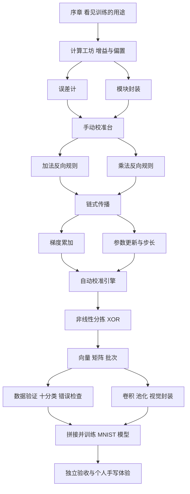
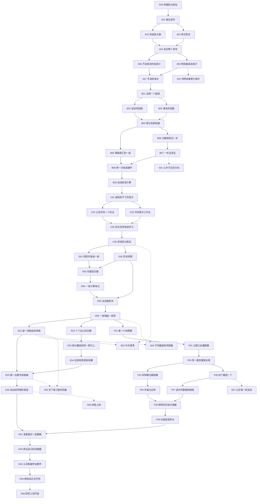

# 深度学习关卡树与玩法设计

策划版本：1.1。日期：2026 年 10 月 2 日。目标玩家：有高中数学基础，没有深度学习经验。

**完整主线共 47 关，另有 8 关可选支线。** 玩家修复一座分拣站，逐步把自己的运算部件、梯度规则、训练器、张量层与视觉模块搭成可在本机训练的手写数字分类系统。

这是关卡策划方案。关卡操作、前置关系和解锁成果已经具体化；训练阈值、计算预算和游玩时长仍需用参考实现与试玩标定。文中出现的 90%、95% 与五万参数属于原型起点，并非已测得结果或最终通关标准。

完整可点击地图见 [关卡图](level-map.html)，单一关卡数据源见 [关卡数据](levels.json)。页面完全离线，使用浏览器打开即可；点击节点可查看玩法和全部前置路径。

本版补充了 [模块首次教学与解锁审计](module-introductions.md) 和 [全部关卡的结果可视化](visualization-design.md)。当前登记的 69 项玩家可见工具与模块均有首次教学；55 关均规定主画面、操作联动、失败定位和通关成果。S03 与 S04 支线增加 E01 前置，S06 使用已学全连接层完成压缩。

## 关卡树的组织

关卡树采用有分支和汇合的依赖图。每条实线表示前置依赖，多条进入同一节点的实线均需满足。虚线连接可选支线，支线不会阻挡必修进度。

前期，增益与偏置两路汇合为计算单元；误差计与模块封装两路汇合成持续工程。学习阶段，加法和乘法的反向规则汇合为链式传播，分支累加与步长控制汇合成训练循环。后期，数据评估和视觉构建两路并行，最终汇合到 MNIST 任务。

每个正式模块保存玩家做出的结构、参数接口和反向行为，能够在后续关卡中展开。序章提供的现成模型只用于体验；玩家后续通过构建任务获得独立的模块能力。

## 工程节点与原型范围

| 工程节点 | 玩家拥有的成果 | 范围 |
| --- | --- | --- |
| A07 手动校准台 | 可展开的计算单元与误差计 | 第一台有用途的设备 |
| B09 自动校准引擎 | 正向、反向、更新与循环组成的真实训练器 | 从起点到此共 17 个必修关卡 |
| C05 非线性分拣站 | 玩家搭建并训练的小型 MLP | 从起点到此共 22 个必修关卡 |
| E05 第一台数字读取器 | 可以比较的全连接数字分类器 | 数据与分类路线的成果 |
| F09 封装视觉积木 | 可配置的卷积与池化模块库 | 视觉路线的成果 |
| G04 邮政站正式开机 | 可使用并导出的手写数字模型 | 完整主线 47 个必修关卡 |

建议先完成至 B09 的完整闭环，再扩展到 C05。此前十四关草案拆分了若干复合任务，形成当前 17 关训练器与 22 关非线性分类的依赖范围；后续开发以本版依赖数据为准。

## 通用操作与判定

构建关以拖放、接线、单步检查为主；实验关通过一次只改变一个主要条件来观察趋势；修复关给出可以定位的错误；封装关让玩家定义并复用接口；工程关把已有成果安装回分拣站。

数值部件采用明确输入输出规格、有限差分检查和约定容差。有限差分避开 ReLU 的不可导点。模型关采用固定数据角色、训练预算与参考实现标定的表现线。实际数值来自真实训练，批量加速保持同一模型含义。

诊断关 C01 的目标是观察线性能力限制，玩家不会被要求完成不可能的 XOR 线性解。诊断关 E06 的目标是形成一次受控检查，模型改善不是本关的必然通关要求。

提示分三级：先突出需要观察的数值或样本；再显示对应局部规则；最后给出一个局部接线示例。通关反馈显示这一关做出的部件在哪里进入后续项目。

## 任务数据与执行约定

| 数据包 | 用途与约定 |
| --- | --- |
| 校准数据 | 固定的简单仿射函数，使用训练样本和独立新输入验证校准 |
| 梯度数据 | 正数、负数、零、非单位上游梯度、共享参数与重复操作数 |
| XOR 数据 | 四种基本输入，按功能检查四点分类；不将此结果解释为泛化证明 |
| 张量数据 | 可手算的小向量与矩阵，明确轴顺序和批次维度 |
| 视觉数据 | 8×8 或 16×16 程序生成图像，控制边缘、位置和噪声 |
| MNIST 数据 | 在标准训练数据中固定划出训练与验证集合，标准测试集保留到正式验收 |
| 个人手写数据 | 画板数据独立记录，统一预处理；支线个人训练与个人验证也保持隔离 |

MNIST 实验先使用按类别覆盖的较小子集，后续扩大。G04 验收时冻结模型与预处理；模型若再次根据验收结果调整，应视为新的实验记录，并说明原测试集已经被查看。个人画板体验不要求全部笔迹都被识别正确。

输入输出形状默认明确标出批次、空间尺寸和通道。复制模块默认创建独立参数，显式共享才复用同一参数身份。观察模式与快速执行模式使用同一组权重，保持约定精度内的正向与反向一致。

## 完整关卡索引

| 编号 | 关卡 | 玩法类型 | 前置 | 解锁成果 |
| --- | --- | --- | --- | --- |
| P00 | 停摆的分拣站 | 体验 | 起点 | 自己的空工作台、输入端口和数值探针。 |
| A01 | 看见信号 | 构建 | P00 | 连线、探针和常量源。 |
| A02 | 校准放大器 | 调参 | A01 | 乘法器、可训练参数。 |
| A03 | 修正零点 | 构建 | A01 | 加法器、偏置插槽。 |
| A04 | 混合两个信号 | 构建 | A02、A03 | 双输入加权计算结构；完成 A06 后可封装复用。 |
| A05 | 不会抵消的误差计 | 构建 | A04 | Loss 模块的正向部分。 |
| A06 | 把机器装进盒子 | 封装 | A04 | 模块库、实例化与展开。 |
| A07 | 手动校准台 | 工程 | A05、A06 | 一台需要自动校准的持续工程。 |
| B01 | 试探一个旋钮 | 实验 | A07 | 敏感度探针、反向端口。 |
| B02 | 加法的回路 | 构建 | B01 | 支持反向传播的 Add。 |
| B03 | 乘法的回路 | 构建 | B01 | 支持反向传播的 Multiply。 |
| B04 | 穿过多层机器 | 构建 | B02、B03 | 串联图自动反向执行。 |
| B05 | 两条路汇到一起 | 修复 | B04 | 分支图与共享参数的反向支持。 |
| B06 | 沿着趋势迈一步 | 构建 | B04 | SGD 更新模块。 |
| B07 | 一步迈多远 | 实验 | B06 | 学习率设置与轨迹对照。 |
| B08 | 把一次变成循环 | 构建 | B05、B07 | 训练循环控制器、暂停与继续。 |
| B09 | 自动校准引擎 | 工程 | B08 | 可复用训练器、权重存档、第一项工程成果。 |
| C01 | 直线到不了的地方 | 诊断 | B09 | 非线性实验台。 |
| C02 | 让信号有一个折点 | 构建 | C01 | ReLU 正向模块。 |
| C03 | 中间表示工作台 | 构建 | C01 | 隐藏层接口、多单元并行布局。 |
| C04 | 折点怎样参加学习 | 构建 | C02、C03 | 可训练 ReLU、多层可训练图。 |
| C05 | 非线性分拣站 | 工程 | C04 | 小型 MLP、第二项工程成果、张量工坊。 |
| D01 | 把信号装成一排 | 构建 | C05 | 向量端口、向量探针。 |
| D02 | 形状拼图 | 构建 | C05 | 形状检查、Reshape。 |
| D03 | 向量混合器 | 封装 | D01、D02 | Dot 模块。 |
| D04 | 一排计算单元 | 构建 | D03 | MatMul 模块。 |
| D05 | 全连接积木 | 封装 | D04、D02 | Dense 层积木。 |
| D06 | 一批物品一起学 | 构建 | D05 | 批处理、快速张量执行入口。 |
| E01 | 留一些物品来验收 | 数据 | D06 | 验证台、数据划分模块。 |
| E02 | 十个出口的分数 | 构建 | D06 | 多分类输出接口、Argmax 观察器。 |
| E03 | 把分数放到同一把尺上 | 实验 | E02 | Softmax 概率观察器；训练使用 E04 解锁的稳定 CrossEntropy。 |
| E04 | 自信地答错有多糟 | 实验 | E03 | 多分类 CrossEntropy，内置稳定实现。 |
| E05 | 第一台数字读取器 | 工程 | E01、E04 | 基础模型存档、可比较的数字读取方案。 |
| E06 | 找出经常错的笔迹 | 诊断 | E05 | 错误检查器、终章评估工具。 |
| F01 | 看一小块图像 | 构建 | D06 | 局部窗口采样器。 |
| F02 | 让窗口走遍图像 | 构建 | F01 | 二维扫描与特征图视图。 |
| F03 | 同一套权重到处用 | 构建 | F02 | 可训练卷积核。 |
| F04 | 多种眼光看图像 | 构建 | F03 | 多通道 Conv2D。 |
| F05 | 步幅与边界 | 实验 | F04 | 参数化 Conv2D 完整接口。 |
| F06 | 四个数选一个 | 构建 | F03 | MaxPool 正向模块。 |
| F07 | 选中的数接回梯度 | 构建 | F06 | 可训练 MaxPool。 |
| F08 | 把特征交给分类器 | 构建 | F05、F07 | Flatten、视觉到分类接口。 |
| F09 | 封装视觉积木 | 工程 | F08 | 视觉模块库、第三项工程成果。 |
| G01 | 准备最后一批数据 | 数据 | E06、F09 | 终章数据管线。 |
| G02 | 拼出自己的读取器 | 构建 | G01 | 终章训练资格、结构对照存档。 |
| G03 | 让读取器学会数字 | 训练 | G02 | 训练好的数字读取器、可恢复权重。 |
| G04 | 邮政站正式开机 | 终章 | G03 | 完整项目、模型导出、开放研究工坊。 |
| S01 | 同样结果更少部件 | 支线 | A06 | 优化徽记与紧凑模块蓝图，不阻挡主线。 |
| S02 | 让步子记住方向 | 支线 | B07 | Momentum 更新器，不阻挡主线。 |
| S03 | 半月港湾 | 支线 | C05、E01 | 二维实验场景，不阻挡主线。 |
| S04 | 不同量纲的传感器 | 支线 | D06、E01 | Normalize 模块，不阻挡主线。 |
| S05 | 背下练习册的机器 | 支线 | E01、E05 | EarlyStop 与快照选择工具，不阻挡主线。 |
| S06 | 轻装上岗 | 支线 | E06 | 轻量模型蓝图，不阻挡主线。 |
| S07 | 让区域一起说话 | 支线 | F06 | AveragePool 模块，不阻挡主线。 |
| S08 | 研究工坊开放 | 支线 | G04 | 自定义任务与模块导出，不阻挡主线。 |

## 逐关玩法

### 序章 让机器动起来

先看见学习能够改变机器的行为。

#### P00 停摆的分拣站

类型：体验。前置：无。主要知识点：训练改变模型行为。

分拣站把大部分物品送错了出口。

**首次教学：** 无新增模块，复用已学能力。

**开场文本：** 这是一台借来体验的机器。训练会改变机器保存的参数；模型结构、训练按钮和分拣出口先作为整机演示，暂不进入你的模块库。

**教学演示：** 把同一件物品在训练前后各运行一次，并查看参数变化。

**起始工具：** 已组装的小模型、带标签样本、训练按钮和两个出口。

**玩家操作：** 运行未训练模型；启动短训练；把相同样本再送入分拣站，对照前后结果。

**反馈：** 同一模型的预测、权重和正确分拣数量同步变化，训练用真实计算。

**结果画面：** 分拣站的样本卡与两个出口；左右并列未训练、训练后的同一批结果，附正确数与实际权重。

**操作联动：** 点选样本联动两份预测；拖训练步回放权重和出口改变。

**通关：** 完成训练前后两次运行并检查一个改善的样本。

**解锁：** 自己的空工作台、输入端口和数值探针。

**首级提示：** 先保留同一组样本，才能比较机器前后的变化。

### 计算工坊

构建可调计算单元与误差计。

#### A01 看见信号

类型：构建。前置：P00。主要知识点：输入与输出的数据流。

传感器已经工作，显示器没有读数。

**首次教学：** 数值端口与连线、单步与数值探针、常量源。

**开场文本：** 输入给机器提供一个数，显示器把输出显示出来。先接线，再切换样本；常量源始终输出你设定的数。

**教学演示：** 将输入与常量源先后接到同一显示器，用探针单步读取。

**起始工具：** 输入、显示器、连接线、单步按钮。

**玩家操作：** 把传感器接到显示器；切换三个样本；单步追踪数值经过的端口。

**反馈：** 亮起的连接与数值标签显示当前数据流。

**结果画面：** 端口、线与数字显示器；一份样本只在当前计算步高亮实际经过的节点。

**操作联动：** 切样本或单步，选中线查看数值与来源。

**通关：** 三个样本显示正确，且连接覆盖实际输入。

**解锁：** 连线、探针和常量源。

**首级提示：** 显示器应接收输入端的数值。

#### A02 校准放大器

类型：调参。前置：A01。主要知识点：权重控制输入影响的强度。

称重传感器的读数总是偏小。

**首次教学：** 乘法器、可训练参数。

**开场文本：** 乘法器让一个输入按另一个输入的倍数变化。参数是机器保存的旋钮数值，先手动调整，后面再教它自动调整。

**教学演示：** 将参数依次设为二、零、负一，观察同一输入。

**起始工具：** 乘法器、输入、可调参数、四组期望读数。

**玩家操作：** 把参数接入乘法器；调节增益；检查不同重量下是否同时吻合。

**反馈：** 输出随旋钮变化，样本误差并列显示。

**结果画面：** 输入横轴、输出纵轴的直线与期望点；旋钮旁显示权重，样本表显示输出。

**操作联动：** 拖权重同步改变斜率；负权重时箭头与数值显示反号。

**通关：** 满足全部校准样本及一个新输入的线性比例规格。

**解锁：** 乘法器、可训练参数。

**首级提示：** 比较期望读数与传感器读数的比例。

#### A03 修正零点

类型：构建。前置：A01。主要知识点：偏置平移输出。

另一只传感器始终多报一个固定量。

**首次教学：** 加法器、偏置插槽。

**开场文本：** 加法器可以给所有输入增加同一个量。这个可调常量放在偏置插槽里，即使输入为零仍会影响输出。

**教学演示：** 切换零输入与非零输入，调同一个偏置。

**起始工具：** 加法器、常量和不同输入的期望输出。

**玩家操作：** 增加一个可调常量；让多个输入同时修正；观察零输入时的输出。

**反馈：** 所有输出一起平移，比例关系保持可见。

**结果画面：** 期望点、当前直线与零输入标记；纵向位移标尺显示偏置。

**操作联动：** 拖偏置，整条线平移；点选零输入确认截距。

**通关：** 满足全部偏移规格和零输入检查。

**解锁：** 加法器、偏置插槽。

**首级提示：** 每个样本的差值是否相同。

#### A04 混合两个信号

类型：构建。前置：A02、A03。主要知识点：加权求和。

出口要同时参考重量和亮度。

**首次教学：** 双输入加权单元。

**开场文本：** 不同输入各乘自己的权重，再加偏置。本关先做出展开结构，下一条支线才教封装成盒子。

**教学演示：** 固定亮度，只改重量，再交换控制的输入。

**起始工具：** 两个输入、已做出的加法和乘法、权重与偏置。

**玩家操作：** 搭出两个输入的加权组合；按示例调节两个权重与偏置；检查改变一个输入的效果。

**反馈：** 二维样本和输出数值展示每个输入的影响。

**结果画面：** 二维输入点和输出读数；贡献条并列显示 w1×x1、w2×x2、b 与总和。

**操作联动：** 固定一个输入只调另一个；点贡献条定位对应乘法器。

**通关：** 满足给定仿射函数的多组输入输出规格。

**解锁：** 双输入加权计算结构；完成 A06 后可封装复用。

**首级提示：** 先固定一个输入，检查另一个输入的贡献。

#### A05 不会抵消的误差计

类型：构建。前置：A04。主要知识点：平方误差作为目标。

正误差与负误差互相抵消，误差计误以为机器已经校准。

**首次教学：** 半平方误差计。

**开场文本：** 误差有正有负，直接相加会抵消。残差平方后两边都为正，再乘二分之一构成本关损失。

**教学演示：** 比较残差为正二、负二与零的三个样本。

**起始工具：** 预测、目标、加法、乘法、负一与二分之一常量。

**玩家操作：** 构建残差与半平方误差；让正负同幅误差经过它；比较小错与大错。

**反馈：** 输入残差和非负损失同步显示。

**结果画面：** 残差横轴与半平方损失抛物线；当前点与正负同幅对照点同时显示。

**操作联动：** 拖预测或目标，同步更新残差、平方中间值和损失；切换错误求和方案。

**通关：** 损失符合半平方误差规格，包括零残差与正负残差。

**解锁：** Loss 模块的正向部分。

**首级提示：** 先让正负误差产生相同的评价。

#### A06 把机器装进盒子

类型：封装。前置：A04。主要知识点：模块接口与复用。

三台分拣设备都需要同样的计算单元。

**首次教学：** 模块封装与实例。

**开场文本：** 盒子只保留你定义的接口，内部接线依然存在。复制实例默认复制参数，不会让两台机器自动共享旋钮。

**教学演示：** 放两个实例，改变一个旋钮，再分别展开。

**起始工具：** 玩家的计算子图、框选工具、输入输出端口编辑器。

**玩家操作：** 框选并命名子图；指定接口；放置两个实例并分别调整参数。

**反馈：** 折叠后仍显示端口与参数，展开可回到内部接线。

**结果画面：** 展开子图到模块盒子的对应动画，接口名单与两个实例参数面板并排。

**操作联动：** 折叠、展开；改变一个实例旋钮，观察另一个是否变化。

**通关：** 两个实例满足不同规格，参数默认独立，展开结构正确。

**解锁：** 模块库、实例化与展开。

**首级提示：** 先决定盒子的输入和输出，再确定它包含哪些节点。

#### A07 手动校准台

类型：工程。前置：A05、A06。主要知识点：模块组合与目标检查。

把自己的计算单元安装到整台校准设备中。

**首次教学：** 求和后取平均。

**开场文本：** 校准台同时面对多个样本。先求各损失之和，再乘样本数的倒数，就是平均损失。

**教学演示：** 把一、三、五、七接成平均器，得到四，再装到校准台。

**起始工具：** 已封装计算单元、误差计、固定校准数据。

**玩家操作：** 拼接完整输入到损失的路径；手动调节参数；保存当前设备并投入运行。 开始调参前，先用四个损失数值接出求和乘四分之一的平均器。

**反馈：** 每个样本的损失、整体平均损失和实际设备输出。

**结果画面：** 整台校准设备、逐样本损失表和平均损失分解条；四个损失到平均器可展开。

**操作联动：** 逐样本播放，调参时全部样本与平均数一起刷新。

**通关：** 连接完整，平均误差达到校准规格，并通过新输入检查。

**解锁：** 一台需要自动校准的持续工程。

**首级提示：** 同时查看所有样本，避免只修好一个输入。

#### S01 同样结果更少部件

类型：支线。前置：A06。主要知识点：代数等价与构建优化。

工坊希望节省相同功能的零件。

**首次教学：** 部件计数与等价对照。

**开场文本：** 部件数与参数数是两回事。优化结构时，先保证同一输入下结果一致，再比较使用的部件数量。

**教学演示：** 给两份结构同步输入，运行等价对照。

**起始工具：** 一个冗余计算子图、基础部件计数器。

**玩家操作：** 合并可合并的步骤；用新输入检查等价性；保存更紧凑的模块。

**反馈：** 结果对照与部件数变化。

**结果画面：** 两份结构同步计算、逐样本输出差值和部件计数。

**操作联动：** 点差值定位产生分歧的节点；切未见输入检查等价性。

**通关：** 保持输入输出规格并减少部件数量。

**解锁：** 优化徽记与紧凑模块蓝图，不阻挡主线。

**首级提示：** 哪些操作可以先合并成一个常量或一个表达式。

### 学习引擎

组合梯度规则、参数更新和训练循环。

#### B01 试探一个旋钮

类型：实验。前置：A07。主要知识点：有限差分与局部敏感度。

权重增多，盲目旋转已经很难找到改进方向。

**首次教学：** 敏感度探针、变化率比值显示、反向端口。

**开场文本：** 变化率可以从一小步试探得到。反向端口要保存的是目标对当前数的敏感程度，箭头表示计算方向，不代表错误在管道里流动。

**教学演示：** 只移动一个参数，显示损失差值、参数差值及二者比值。

**起始工具：** 已封装损失系统、微小参数位移、前后差值显示。

**玩家操作：** 给参数一个小位移；比较损失变化；把变化量除以位移，在几个状态下记录趋势。 用面板的比值测量解释每单位位移的变化；本关不开放通用可微除法算子。

**反馈：** 参数位移、损失位移和变化率同时可见。

**结果画面：** 损失随单个参数变化的一维曲线；当前位置、微小位移和割线三角形。

**操作联动：** 控制位移大小，读取 Δ参数、Δ损失及比值；每次只动一个参数。

**通关：** 探针在几组光滑状态下得到符合数值检查的变化率。

**解锁：** 敏感度探针、反向端口。

**首级提示：** 用小位移观察当前附近的变化。

#### B02 加法的回路

类型：构建。前置：B01。主要知识点：加法的局部反向规则。

加法器只会正向运行，训练信号无法传回。

**首次教学：** Add 反向规则。

**开场文本：** 加法的任一输入增加一点，输出也增加同样一点。上游梯度因此原样分给两个输入。

**教学演示：** 输入变化与反向结果并列，再把上游梯度设为非一的数。

**起始工具：** 加法器、上游梯度端口、反向连接模板。

**玩家操作：** 微调两个输入观察输出；完成两个反向端口；用不同上游梯度检查它。

**反馈：** 每个输入收到的梯度与数值探针结果对照。

**结果画面：** 加法器两输入微调对照；反向箭头旁直接标上游梯度与两个输出梯度。

**操作联动：** 切换非单位上游梯度，比较有限差分参考。

**通关：** 两个输入均收到上游梯度，包括非单位上游梯度。

**解锁：** 支持反向传播的 Add。

**首级提示：** 输出对任意一个输入的小变化都会等量变化。

#### B03 乘法的回路

类型：构建。前置：B01。主要知识点：乘法的局部反向规则。

乘法器需要知道两个输入各自影响输出的程度。

**首次教学：** Multiply 反向规则。

**开场文本：** 乘法器对某个输入的敏感度，由另一个输入决定。反向结果还要乘上已经到达这里的上游梯度。

**教学演示：** 用负二、三和上游梯度四核对十二与负八。

**起始工具：** 乘法器、当前两个输入、上游梯度和已有算子。

**玩家操作：** 为两个反向输出接线；测试正数、负数与零；观察另一输入改变时梯度如何改变。

**反馈：** 反向输出符号和幅值与实际微调结果比较。

**结果画面：** 两个输入、乘积与两条反向贡献条；显示 g×另一输入的中间乘积。

**操作联动：** 拖输入穿过零，查看反向结果的大小和符号。

**通关：** 传向 a 的梯度为 g×b，传向 b 的梯度为 g×a，覆盖负数与零。

**解锁：** 支持反向传播的 Multiply。

**首级提示：** 固定一个输入，改变另一个输入时输出变化几倍。

#### B04 穿过多层机器

类型：构建。前置：B02、B03。主要知识点：链式法则与反向顺序。

输入经过多次运算后才影响损失。

**首次教学：** 反向调度与标量种子。

**开场文本：** 标量目标对自己变化的比率为一，因此从一开始反向。本关只用无分支串联图，每个节点等下游结果到达后，再按局部规则传到前面；多路贡献在 B05 学习。

**教学演示：** 把执行步骤卡从标量目标端排回输入端，单步查看一条没有重复输入的路径。

**起始工具：** 不含共享输入的串联运算图、标量目标端梯度一、可移动的执行顺序；平方误差整图留到 B05 后组合。

**玩家操作：** 串起局部反向端口；从标量目标端单步运行；调整顺序让下游结果到达后再向前传播。

**反馈：** 沿途局部导数与组合梯度逐步出现。

**结果画面：** 无分支串联计算图与步骤时间轴；正向值和反向值分两行，下游结果到达的节点才可运行。

**操作联动：** 单步反向；点节点展开局部导数和组合梯度。

**通关：** 多层图的输入和参数梯度符合数值检查，执行顺序满足依赖。

**解锁：** 串联图自动反向执行。

**首级提示：** 先知道下游的变化，再继续往前传。

#### B05 两条路汇到一起

类型：修复。前置：B04。主要知识点：分支梯度累加。

同一个权重被两条路径使用，机器只收到其中一条贡献。

**首次教学：** 梯度累加器、共享参数引用。

**开场文本：** 同一个参数可以被多处引用。它改变时每条路径都会影响目标，总变化率是各路径贡献之和。

**教学演示：** 将同一个 w 连接到两条分支，对照两个独立参数的情况。

**起始工具：** 分支图、共享参数、梯度收集器。

**玩家操作：** 检查两条路径各自的贡献；修复梯度收集方式；在平方运算中检查同一输入重复使用。

**反馈：** 每条贡献与总梯度分开展示。

**结果画面：** 共享参数身份标签、分支图与可正可负的贡献条，总梯度位于零轴旁。

**操作联动：** 逐条启用路径；切换共享参数与独立副本。

**通关：** 共享参数梯度是全部使用路径的贡献和，重复操作数也正确。

**解锁：** 分支图与共享参数的反向支持。

**首级提示：** 这个参数改变时，哪些路径都会跟着变化。

#### B06 沿着趋势迈一步

类型：构建。前置：B04。主要知识点：梯度下降更新。

机器已经知道变化趋势，仍需要把趋势变成参数调整。

**首次教学：** SGD 与学习率。

**开场文本：** 梯度表示目标在当前位置如何变化。参数减去学习率乘梯度，就得到一次朝局部下降方向的更新。 上游梯度由题目提供，完整计算图的自动训练在 B08 与 B09 组合。

**教学演示：** 预测更新方向，再执行一步并检查新损失。

**起始工具：** 参数、题目提供的梯度样例、步长以及加法乘法；本关只构建更新器。

**玩家操作：** 连接参数更新器；预测一步后参数的变化；执行一次并查看损失。

**反馈：** 更新前后参数、梯度、步长和损失并列。

**结果画面：** 一维损失曲线、当前位置和更新后位置；分别标梯度方向与实际移动箭头。

**操作联动：** 先预测方向，再单步更新；切换参数查看计算式。

**通关：** 更新符合 w 新值等于 w 减去学习率乘梯度的规格。

**解锁：** SGD 更新模块。

**首级提示：** 让参数朝损失在局部下降的方向移动。

#### B07 一步迈多远

类型：实验。前置：B06。主要知识点：学习率影响稳定性。

正确方向也可能因为步子太大而不断来回摆动。

**首次教学：** 无新增模块，复用已学能力。

**开场文本：** 沿用已解锁 SGD。本关只改变学习率，比较走得太慢、来回振荡和越走越远。

**教学演示：** 保持初始参数不变，重跑三个不同步长。

**起始工具：** 固定二次损失及其变化率输入、正确更新器、学习率旋钮、轨迹；本关使用参考场景对照，完整自建训练循环在 B08。

**玩家操作：** 比较几个步长；观察缓慢下降、振荡和发散；选一个步长完成校准。

**反馈：** 权重轨迹、损失轨迹和单步位置。

**结果画面：** 同一起点的多条参数轨迹与损失曲线，按训练步对齐。

**操作联动：** 选择步长重跑；点训练步定位曲线和损失地形上的位置。

**通关：** 在固定预算内将该损失降至任务线，并展示一次不稳定轨迹用于比较。

**解锁：** 学习率设置与轨迹对照。

**首级提示：** 看看一次更新有没有跨过低损失区域太远。

#### B08 把一次变成循环

类型：构建。前置：B05、B07。主要知识点：训练循环的状态与阶段。

运行第二次更新后，旧梯度让机器行为异常。

**首次教学：** 训练循环与清空操作。

**开场文本：** 每轮训练都要用当前参数重新预测。梯度先清空，再为这一轮累加；更新之后旧缓存也不能直接复用。

**教学演示：** 将正向、清空、反向、更新步骤接成循环，暂停在第二轮。

**起始工具：** 正向、梯度清空、反向、参数更新四种步骤和循环控制器。

**玩家操作：** 组装执行流程；连续运行；定位旧梯度或旧缓存造成的异常并修复。

**反馈：** 当前阶段、训练步、缓存和梯度累积可暂停检查。

**结果画面：** 正向、清空、反向、更新四阶段环与状态表，标当前轮号和缓存所属轮号。

**操作联动：** 暂停第二轮，展开梯度槽；改变步骤顺序查看影响。

**通关：** 连续多次更新与参考流程一致，每步使用当前正向值且清空旧梯度。

**解锁：** 训练循环控制器、暂停与继续。

**首级提示：** 这一轮的梯度应来自这一轮的预测。

#### B09 自动校准引擎

类型：工程。前置：B08。主要知识点：端到端真实训练。

把自己做出的学习机制安装回校准台。

**首次教学：** 可复用训练器、权重快照与载入。

**开场文本：** 把已经做出的步骤封装成训练器。快照保存当前权重；载入快照后，相同输入应得到相同结果。

**教学演示：** 先跑一次训练步，再连续训练；保存并载入权重。

**起始工具：** 玩家的计算单元、Loss、梯度规则、SGD 和循环。

**玩家操作：** 连接完整训练器；在固定校准数据上自动训练；保存权重并在新输入上运行。

**反馈：** 真实损失下降、参数变化和实际设备行为。

**结果画面：** 设备运行、平均损失曲线、参数轨迹与训练阶段灯；所有曲线来自实际训练器。

**操作联动：** 训练、暂停、单步；保存载入快照，查看同一新输入结果。

**通关：** 整个训练路径由玩家已有模块组成，达到校准误差线并通过未参与更新的新输入。

**解锁：** 可复用训练器、权重存档、第一项工程成果。

**首级提示：** 从一个训练步开始逐段检查，再开启循环。

#### S02 让步子记住方向

类型：支线。前置：B07。主要知识点：动量优化的状态。

狭长损失区域中的更新来回摆动。

**首次教学：** Momentum 与速度状态。

**开场文本：** 动量增加一个速度状态，逐轮衰减旧速度并加入当前梯度。开始新比较时把速度归零。

**教学演示：** 保持初始参数与梯度任务相同，对照 SGD 与动量轨迹。

**起始工具：** 固定损失场景、SGD、速度状态槽与动量模板。

**玩家操作：** 构建带历史状态的更新器；比较同一初始化的轨迹；调整历史贡献。

**反馈：** 梯度、速度与两条轨迹同时显示。

**结果画面：** 同起点 SGD 与动量轨迹；每步速度分解为衰减旧速度和当前梯度。

**操作联动：** 拖动量系数；重置实验查看速度是否归零。

**通关：** 动量更新符合约定，在固定场景达到比较目标。

**解锁：** Momentum 更新器，不阻挡主线。

**首级提示：** 上一步的方向怎样影响这一步。

### 非线性分拣

让已有训练器驱动多层网络。

#### C01 直线到不了的地方

类型：诊断。前置：B09。主要知识点：线性模型的表达能力限制。

四件物品位于二维四角，同类物品处于对角。

**首次教学：** 分类门槛与边界探针。

**开场文本：** 通过固定门槛把数值输出转成类别，边界就是等于门槛的位置。观察直线为何无法把 XOR 四点完全分开。

**教学演示：** 保存两条不同直线，逐个检查四点在边界哪侧。

**起始工具：** 可调线性模型、XOR 四点、决策边界叠加。

**玩家操作：** 移动并旋转边界；保留两种不同的错分方案；用边界探针检查四点的位置关系。

**反馈：** 四点的类别、预测和同侧关系同时可见。

**结果画面：** XOR 四点、当前直线和门槛；真实类别用形状、预测用出口边框区分。

**操作联动：** 旋转平移直线，保存两组边界并逐点比较。

**通关：** 完成指定的两组边界对照和四点观察步骤；本关不要求线性模型完成 XOR。

**解锁：** 非线性实验台。

**首级提示：** 每次修好一组点时，另外一组会发生什么。

#### C02 让信号有一个折点

类型：构建。前置：C01。主要知识点：ReLU 的分段行为。

需要一个能改变函数形状的部件。

**首次教学：** 分段门与 ReLU。

**开场文本：** 分段门依据输入正负选择输出。ReLU 保留正数，把负数变成零，于是函数在零处出现折点。

**教学演示：** 拖动输入穿过负数、零与正数，观察门的选择。

**起始工具：** 零常量、分段门、正负输入测试带。

**玩家操作：** 搭建正输入保留、负输入输出零的部件；拖动输入穿过零点；查看曲线。

**反馈：** 输入输出曲线直接显示折点。

**结果画面：** 输入输出坐标系中的 ReLU 折线和当前点；分段门当前选择可见。

**操作联动：** 拖输入越过零，联动门选择、输出与曲线点。

**通关：** 正负与零输入均满足 ReLU 正向规格。

**解锁：** ReLU 正向模块。

**首级提示：** 分别检查零点两侧的规则。

#### C03 中间表示工作台

类型：构建。前置：C01。主要知识点：隐藏层形成中间表示。

原始两个测量值需要先变成新的内部信号。

**首次教学：** 隐藏层接口。

**开场文本：** 隐藏层先造出中间信号，再交给下一层。本关的两级仿射计算仍是线性的，之后接入非线性才有新的表达能力。

**教学演示：** 用两个隐藏输出作为坐标，追踪同一样本。

**起始工具：** 多个已封装计算单元、二维样本、内部输出探针。

**玩家操作：** 搭两个并行计算单元；把它们的输出接入下一单元；观察每件物品的内部坐标。

**反馈：** 原始平面与内部表示平面联动。

**结果画面：** 原始二维平面与两隐藏输出组成的中间平面，使用相同样本编号。

**操作联动：** 选同一物品时联动两个坐标；调单个单元只更新对应坐标轴。

**通关：** 指定的两级仿射组合正确，能在两个平面定位同一样本。

**解锁：** 隐藏层接口、多单元并行布局。

**首级提示：** 先检查中间信号，再检查最终输出。

#### C04 折点怎样参加学习

类型：构建。前置：C02、C03。主要知识点：ReLU 的反向规则。

新的网络能前向计算，训练信号却停在激活部件。

**首次教学：** ReLU 反向规则。

**开场文本：** ReLU 在正区间会传递局部变化，在负区间输出不变。反向因此选择通过上游梯度或输出零。

**教学演示：** 分别暂停在开启与关闭状态，检查梯度门。

**起始工具：** ReLU 输入值、上游梯度、反向门。

**玩家操作：** 完成两侧的反向规则；分别检查开启与关闭状态；把它接回多层训练图。

**反馈：** 梯度通过或被截断的位置直接显示。

**结果画面：** ReLU 正向折线与反向通行门；输入符号、上游梯度、回传值同时显示。

**操作联动：** 切换正负输入和不同上游梯度；零点显示采用的规则。

**通关：** 正输入通过上游梯度，负输入传回零；零点使用引擎统一约定。

**解锁：** 可训练 ReLU、多层可训练图。

**首级提示：** 在当前这一侧，输入小变化会让输出变化多少。

#### C05 非线性分拣站

类型：工程。前置：C04。主要知识点：隐藏层与非线性共同提供表达能力。

用新的部件处理先前无法正确分开的四件物品。

**首次教学：** MLP 与非对称初始化。

**开场文本：** 把隐藏层、ReLU 与输出层组合为 MLP。隐藏单元从小而不同的权重开始，否则可能一直学习同样的区域。

**教学演示：** 对照相同初始化与不同初始化的隐藏响应，再开始正式训练。

**起始工具：** 玩家的训练器、计算单元、ReLU、XOR 数据。

**玩家操作：** 搭小型隐藏层与输出层；真实训练；展开一个隐藏单元查看其覆盖区域。

**反馈：** 决策区域、四点结果、中间表示和损失联动。

**结果画面：** 真实训练得到的二维决策区域、XOR 四点、隐藏单元响应小图与损失曲线。

**操作联动：** 选训练步联动边界；选隐藏单元突出其响应区域；保存初始化对照。

**通关：** 四种 XOR 输入全部分类正确，训练过程和模块接口有效。

**解锁：** 小型 MLP、第二项工程成果、张量工坊。

**首级提示：** 让不同隐藏单元形成不同区域，再组合它们。

#### S03 半月港湾

类型：支线。前置：C05、E01。主要知识点：非线性结构的迁移。

来自港口的两类物品分布成弯曲的两个月牙。

**首次教学：** 无新增模块，复用已学能力。

**开场文本：** 复用已学网络与边界工具，改用半月数据。训练和保留样本的角色沿用此前规则，不开放新运算模块。

**教学演示：** 调隐藏单元数量，观察区域覆盖与新样本表现。

**起始工具：** 固定合成训练与验证数据、小型 MLP。

**玩家操作：** 调整隐藏单元数量；查看各单元区域；在新样本上检查边界。

**反馈：** 隐藏特征、决策区域和验证错分。

**结果画面：** 半月样本与真实决策区域；隐藏响应分页展示，训练验证样本用不同标记。

**操作联动：** 调隐藏宽度或选单元查看响应，观察保留样本结果。

**通关：** 在指定规模下达到标定的验证目标。

**解锁：** 二维实验场景，不阻挡主线。

**首级提示：** 让多个局部区域协作覆盖曲线。

### 张量装配线

把小计算扩展到向量、矩阵和批次。

#### D01 把信号装成一排

类型：构建。前置：C05。主要知识点：向量作为一组数。

输入数量增加，逐根接线占满工作台。

**首次教学：** 向量打包与拆包。

**开场文本：** 一根向量线把多个数按顺序打包。选中元素时，它在原来的独立输入线上仍有相同身份。

**教学演示：** 打包后交换两个元素的位置，再拆包核对。

**起始工具：** 标量输入、向量打包和拆包器、元素探针。

**玩家操作：** 把多个输入打包；按顺序拆出指定元素；比较逐根线和向量线的结果。

**反馈：** 一根线展开为带索引的数列。

**结果画面：** 独立数值线到带索引向量线的对应图，每个元素同时有编号与数值。

**操作联动：** 点向量元素高亮原始端口；交换顺序再拆包。

**通关：** 打包与拆包保留元素顺序和数值。

**解锁：** 向量端口、向量探针。

**首级提示：** 顺序也是这个接口的一部分。

#### D02 形状拼图

类型：构建。前置：C05。主要知识点：形状与重排。

同样的像素需要在平面与数列之间转换。

**首次教学：** Reshape 与索引映射。

**开场文本：** 形状改变布局，不改变元素数量。反向必须把每个元素的梯度按逆映射放回原来的位置。

**教学演示：** 把二乘三格子排成六个数，再让一个位置收到梯度。

**起始工具：** 小图像网格、形状标签、Reshape 部件。

**玩家操作：** 把二维小图排列成数列再还原；尝试一个元素数量不匹配的形状；检查坐标映射。 让一个指定位置收到梯度，再按逆索引映射放回原布局。

**反馈：** 同一元素在两种布局中同时高亮，不匹配立即指出。

**结果画面：** 二维带编号网格与一维序列联动，旁边显示形状和总元素数。

**操作联动：** 点元素追踪正向位置；给序列某位置一个梯度并反向还原。

**通关：** 合法重排保持数据与约定顺序，非法元素数量被识别。 反向还原保持同一个元素身份。

**解锁：** 形状检查、Reshape。

**首级提示：** 改变布局时总元素数量应相同。

#### D03 向量混合器

类型：封装。前置：D01、D02。主要知识点：点积。

已有加权求和需要接收一整排特征。

**首次教学：** Dot 点积。

**开场文本：** 点积将两个向量按相同索引配对相乘后求和。展开后仍是已经完成反向规则的加法与乘法。

**教学演示：** 选中一个索引，追踪它的乘积、输出贡献和梯度。

**起始工具：** 向量输入、权重向量、标量运算和展开视图。

**玩家操作：** 配对相乘再求和；封装为点积；修改一个位置的权重并检查输出与梯度。

**反馈：** 逐元素乘积与最终总和对应显示。

**结果画面：** 两条向量、逐元素乘积条和总和；梯度条可与前向贡献切换。

**操作联动：** 点索引联动对应元素、权重和乘积；改变长度查看模板展开。

**通关：** 不同长度下点积正确，输入与权重梯度正确。

**解锁：** Dot 模块。

**首级提示：** 每个输入只和对应位置的权重配对。

#### D04 一排计算单元

类型：构建。前置：D03。主要知识点：矩阵乘法组合多个输出。

一个输入需要同时形成多种内部特征。

**首次教学：** MatMul 矩阵乘法、Transpose 转置。

**开场文本：** 矩阵乘法让多组点积并行。转置交换行列布局，反向模板用它把贡献组织到正确的输入与权重位置。

**教学演示：** 先完成二乘三的转置练习，再核对一个输出和两个反向结果的形状。

**起始工具：** 多组权重向量、Dot、矩阵布局。 转置教学卡、二乘三转置练习及可展开的反向接线模板。

**玩家操作：** 把多组点积整理成矩阵计算；对照一个输出列；更改矩阵尺寸查看输出数量变化。 先完成一次转置小练习，再按模板核对输入梯度和权重梯度的行列对应。

**反馈：** 对应行列和输出元素联动高亮。

**结果画面：** 输入矩阵、权重矩阵与输出矩阵；另设小转置网格和反向形状对照。

**操作联动：** 选输出格高亮参与的行列；转置时元素身份沿索引移动。

**通关：** 矩阵乘法数值、输出形状及组合梯度符合规格。

**解锁：** MatMul 模块。

**首级提示：** 先挑一个输出，找到参与它计算的输入与权重。

#### D05 全连接积木

类型：封装。前置：D04、D02。主要知识点：Dense 层参数化封装。

需要把不同宽度的层像积木一样接起来。

**首次教学：** Dense 全连接层、偏置复制与梯度归并、参数计数器。

**开场文本：** Dense 封装矩阵乘法与偏置。复制引用的偏置在反向时汇总贡献；参数计数按身份计算，共享参数只计一次。

**教学演示：** 配置两种宽度，做一次偏置累加练习，再手算本层参数。

**起始工具：** MatMul、偏置向量、模块编辑器、形状接口。

**玩家操作：** 封装 Dense；配置输入输出宽度；拼接两层并修复维度不匹配。 在小布局里试一次偏置复制并汇总梯度；手算权重与偏置数量，与计数器对照。

**反馈：** 端口形状、参数数量和内部计算可展开。

**结果画面：** Dense 模块端口形状、权重网格、偏置引用和参数计数分解。

**操作联动：** 拖层宽，更新矩阵尺寸与计数；展开偏置位置和梯度累加。

**通关：** 不同配置的层正向和反向正确，实例参数独立且形状检查有效。

**解锁：** Dense 层积木。

**首级提示：** 上一层产生的特征数量要符合下一层的输入接口。

#### D06 一批物品一起学

类型：构建。前置：D05。主要知识点：批次与平均梯度。

逐个样本运行很慢，更新轨迹也容易抖动。

**首次教学：** 批次堆叠与平均损失。

**开场文本：** 批次轴代表多个样本，不是一个样本的更多特征。平均损失会平均各样本梯度。

**教学演示：** 对相同样本比较逐个计算与批次计算的一次更新。

**起始工具：** 批次堆叠器、批次损失、Dense 和训练器。

**玩家操作：** 把几个样本堆成批次；构建平均损失；比较逐样本累计与批次计算的同一次更新。

**反馈：** 样本梯度、平均梯度和批次维度同时展示。

**结果画面：** 样本卡堆成批次轴，逐样本梯度条与平均梯度并列。

**操作联动：** 选同一批数据，对照逐个累计和批次计算；切批次大小。

**通关：** 同一批数据的平均损失与梯度一致，批次变化不改变形状约定。

**解锁：** 批处理、快速张量执行入口。

**首级提示：** 先比较同一组样本，注意是求和还是平均。

#### S04 不同量纲的传感器

类型：支线。前置：D06、E01。主要知识点：输入归一化。

一个输入是个位数，另一个输入是数千，训练变得难以调节。

**首次教学：** 训练统计与标准化。

**开场文本：** 在已学训练验证分流后引入标准化。训练集建立统计量，验证集只复用它们；这不等同于固定像素除以二百五十五。 本关的尺度是训练总体标准差，即偏差平方的平均再开方；为零时统一用一。

**教学演示：** 对照两种单位，建立训练统计并锁定变换参数。

**起始工具：** 固定训练与验证数据、统计探针、缩放模块。

**玩家操作：** 比较输入范围；只从训练数据建立缩放；对两个集合使用同一变换并比较训练。

**反馈：** 缩放前后的数据分布与轨迹。

**结果画面：** 各输入原始范围与缩放后范围并列，统计来源标记为训练集；两条训练曲线同步对照。

**操作联动：** 切单位，查看保存的均值与尺度及验证数据复用它们的路径。

**通关：** 统计量来源正确、变换一致，达到固定任务目标。

**解锁：** Normalize 模块，不阻挡主线。

**首级提示：** 建立变换时先检查数据来自哪个集合。

### 数据检验站

训练和评估十分类基础模型。

#### E01 留一些物品来验收

类型：数据。前置：D06。主要知识点：训练集与验证集的用途。

设备在练习样本上很好，新物品却经常错分。

**首次教学：** 训练验证分流、验证器与准确率。

**开场文本：** 训练样本参与更新，验证样本只用于检查。准确率是正确样本比例，和损失是不同的指标。

**教学演示：** 查看样本身份，把验证入口误接到更新路径后修复。

**起始工具：** 固定样本卡、训练入口、验证入口、标签。

**玩家操作：** 将样本分流到训练与验证；禁止验证样本进入参数更新；比较两组结果。

**反馈：** 两个集合的损失和样本身份可追踪。

**结果画面：** 训练、验证两条样本轨道与固定身份；两组损失和准确率分开绘制。

**操作联动：** 选样本追踪去向；切到验证阶段，显示参数版本保持不变。

**通关：** 集合隔离正确，验证期间权重不变，显示两组独立指标。

**解锁：** 验证台、数据划分模块。

**首级提示：** 留出来的物品应只用于检查当前机器。

#### E02 十个出口的分数

类型：构建。前置：D06。主要知识点：多分类输出向量。

邮政站需要分别识别十种数字标记。

**首次教学：** Argmax 类别选择。

**开场文本：** 十个分数位置分别对应十个类别。Argmax 选择最大分数的索引，用于预测出口；训练仍需要下一关的目标。

**教学演示：** 改变两个分数，核对获胜类别与并列的固定索引规则。

**起始工具：** Dense、十个类别端口、样本标签、分数探针。

**玩家操作：** 搭一个十维输出；观察每个分数对应的出口；让最高分指向预测类别。

**反馈：** 十个分数与候选出口同步显示。

**结果画面：** 十个原始分数条与数字出口，强调最大值索引；纵轴明确为分数而非概率。

**操作联动：** 拖两个分数，出口标记即时切换；测试并列规则。

**通关：** 输出维度与类别映射正确，最大分数选择在指定样例上正确。

**解锁：** 多分类输出接口、Argmax 观察器。

**首级提示：** 一个输出位置对应一个类别。

#### E03 把分数放到同一把尺上

类型：实验。前置：E02。主要知识点：Softmax 将分数转为类别概率。

原始分数无法直接按概率比较。

**首次教学：** 指数变换展示、Softmax 概率观察器。

**开场文本：** 指数让相对分数变为正数，归一化得到预测分布。先减最大分数再计算，分布不变但更稳定。此观察器不作为分类训练损失。

**教学演示：** 完成三个指数示例，再对比整体平移和拉大差距。

**起始工具：** 指数、求和与归一化的分步模板，数值稳定的展示组件。

**玩家操作：** 给不同分数向量计算归一化结果；比较拉大分数差距和整体平移；封装输出模块。 先完成指数变换的三个示例，再用分数减最大值验证整体平移不改变分布。

**反馈：** 类别概率总和、排名和分布形状实时变化。

**结果画面：** 原始分数、减最大值、指数结果、归一化分布四个联动面板。

**操作联动：** 整体平移分数或拉大差距，比较前后概率条。

**通关：** 结果非负且和为一，符合 Softmax 规格，稳定处理较大分数。

**解锁：** Softmax 概率观察器；训练使用 E04 解锁的稳定 CrossEntropy。

**首级提示：** 先比较各类相对得分，再看总和归一化。

#### E04 自信地答错有多糟

类型：实验。前置：E03。主要知识点：交叉熵评价真实类别概率。

模型给错误出口很高概率，需要适合十分类的目标。

**首次教学：** 负对数查图器、稳定 CrossEntropy。

**开场文本：** 交叉熵关注分给真实类别的概率。训练模块直接接原始分数，内部稳定计算；分数梯度等于预测分布减真实类别指示。

**教学演示：** 点选真实类别，在查图器比较三种预测，再核对一组反向模板。

**起始工具：** 真实类别、概率展示、负对数查图器、可展开的稳定损失模块。 原始分数输入接口、可展开的概率减类别指示反向模板。

**玩家操作：** 比较自信正确、犹豫、自信错误三种预测；构建正确类别的损失选择；把稳定损失接回训练。 按提示核对一组概率减类别指示的梯度；训练损失接原始分数，不把 Softmax 输出再次当成原始分数。

**反馈：** 真实类别概率和损失沿曲线对应显示。

**结果画面：** 真实类别高亮的概率条、负对数曲线与分数梯度条。

**操作联动：** 点选真实类别，比较三种预测；展开概率减类别指示模板。

**通关：** 损失符合分类目标，类别选择正确，反向可运行且输入约定一致。

**解锁：** 多分类 CrossEntropy，内置稳定实现。

**首级提示：** 只观察分给真实类别的概率怎样改变评价。

#### E05 第一台数字读取器

类型：工程。前置：E01、E04。主要知识点：全连接网络的十分类基础方案。

先用已有积木读取一小批手写数字。

**首次教学：** MNIST 图像与标签入口、灰度缩放与图像展开。

**开场文本：** 第一次接入 MNIST 前，先检查图像与标签，再做零到一灰度缩放和 Reshape 展开。预处理也属于模型输入约定。

**教学演示：** 查看同一张图的原像素、缩放值、展开索引和标签。

**起始工具：** 固定 MNIST 训练子集与验证子集、统一预处理、Dense、ReLU、训练器。

**玩家操作：** 先检查一张图像的标签、灰度缩放和 Reshape 展开结果；再搭全连接网络，训练并保留一个达到任务线的方案。

**反馈：** 真实训练和验证曲线、十类预测和错分画廊。

**结果画面：** 原图、零到一输入和展平索引预览；训练验证曲线与十类错分缩略图。

**操作联动：** 点像素看原值和缩放值；训练后选一张错分图追踪预测。

**通关：** 数据角色正确，达到试玩后标定的基础验证目标；原型起点建议 90%。

**解锁：** 基础模型存档、可比较的数字读取方案。

**首级提示：** 先确认输入布局和损失接口，再调节层宽与步长。

#### E06 找出经常错的笔迹

类型：诊断。前置：E05。主要知识点：通过错误样本诊断模型。

总体分数掩盖了几个反复混淆的类别。

**首次教学：** 混淆矩阵与错分画廊。

**开场文本：** 混淆矩阵的行是真实类别，列是预测类别。错分画廊来自当前选中的格子，帮助提出一次可以比较的改动。

**教学演示：** 从一对混淆类别中选出错误样本，对照同类正确样本。

**起始工具：** 基础模型、错分画廊、混淆矩阵和验证样本。

**玩家操作：** 选择一个混淆较多的类别对；对照正确与错误样本；保留对照记录并重验一个改动。

**反馈：** 所选类别的具体笔迹与对应预测可追踪。

**结果画面：** 带行列标题的十乘十混淆矩阵和所选格子的错分画廊，附每格样本数。

**操作联动：** 点类别对筛样本；对照一次改动前后的同一验证集合。

**通关：** 完成类别对检查和一次受控比较，验证数据没有进入更新。

**解锁：** 错误检查器、终章评估工具。

**首级提示：** 先找经常被混在一起的两类，再查看它们的样本。

#### S05 背下练习册的机器

类型：支线。前置：E01、E05。主要知识点：过拟合与早停。

训练成绩继续改善，验证成绩却开始下降。

**首次教学：** 按验证选择快照。

**开场文本：** 复用权重快照，按验证曲线选择较早模型。较低训练损失不保证更好的新样本表现。

**教学演示：** 延长训练后拖动检查点，查看两条曲线与错分样本。

**起始工具：** 小训练集、较大模型、检查点与两条曲线。

**玩家操作：** 延长训练观察差异；选择较早快照；比较减少模型规模的另一方案。

**反馈：** 训练与验证曲线以及各快照的错误样本。

**结果画面：** 训练与验证两条曲线、检查点时间轴和该点错分样本。

**操作联动：** 拖时间轴载入同一检查点，比较更早与更晚模型。

**通关：** 根据验证选出合适快照，数据隔离正确并完成一次对照。

**解锁：** EarlyStop 与快照选择工具，不阻挡主线。

**首级提示：** 留出的样本在什么时候表现更好。

#### S06 轻装上岗

类型：支线。前置：E06。主要知识点：表现与模型规模的权衡。

边缘设备的参数存储预算缩小。

**首次教学：** 无新增模块，复用已学能力。

**开场文本：** 本支线只压缩已学全连接网络，不要求未解锁的视觉模块。减少层宽或层数，再比较同预算的验证结果。

**教学演示：** 在参数数与验证表现平面中保留两个 Dense 方案。

**起始工具：** 已经能工作的全连接基础模型、参数计数器、相同数据与训练预算；本支线只使用已经解锁的 Dense 网络。

**玩家操作：** 减少已学 Dense 的层宽或层数；在相同数据与预算下重新训练；比较验证表现与参数数量。

**反馈：** 结构、参数和验证结果并列。

**结果画面：** 参数数为横轴、验证准确率为纵轴的方案散点图，点旁列结构与训练预算。

**操作联动：** 只改 Dense 层宽或层数，点方案加载参数账单和验证结果。

**通关：** 在更小参数预算内达到标定目标。

**解锁：** 轻量模型蓝图，不阻挡主线。

**首级提示：** 先找参数数量最多的一层。

### 视觉工坊

亲手形成卷积、池化与视觉模块。

#### F01 看一小块图像

类型：构建。前置：D06。主要知识点：局部窗口的加权计算。

图像局部的明暗组合可能描述边缘。

**首次教学：** 局部窗口采样。

**开场文本：** 局部窗口按图像坐标取出一小块，与核权重一一对应；本关只计算一个窗口，还没有完整扫描。

**教学演示：** 拖动三乘三框，选中一个像素查看它的乘积贡献。

**起始工具：** 8×8 合成图像、3×3 窗口、Dot 与可调权重。

**玩家操作：** 取出九个像素；与九个权重计算点积；手动调节一个简单边缘检测窗口。

**反馈：** 被采样像素、逐项贡献和窗口输出。

**结果画面：** 原图、可移动三乘三窗口、核权重和九项乘积，当前输出为一个数。

**操作联动：** 拖窗口或权重；点乘积高亮对应像素与核位置。

**通关：** 指定窗口坐标的加权计算正确，并通过不同图像样例。

**解锁：** 局部窗口采样器。

**首级提示：** 先确认九个像素与九个权重的排列顺序。

#### F02 让窗口走遍图像

类型：构建。前置：F01。主要知识点：卷积窗口扫描形成特征图。

只看一个位置无法处理整张标记。

**首次教学：** 位置扫描与输出写入、特征图。

**开场文本：** 扫描器把同一个计算结构移动到每个位置，输出写进对应特征图格子。当前位置与输出位置始终成对高亮。

**教学演示：** 单步走完几个位置，再运行完整扫描。

**起始工具：** 窗口采样器、固定滤波权重、位置扫描器、空特征图。

**玩家操作：** 连接扫描路径；按位置写入输出；逐步观察一个特征怎样在图中出现。

**反馈：** 窗口位置与特征图中的输出位置同步高亮。

**结果画面：** 输入窗口与输出特征图一对一高亮，扫描时间轴显示已算与未算位置。

**操作联动：** 单步移动，选输出格反查产生它的输入窗口。

**通关：** 整个特征图的数值、位置和边界规则符合规格。

**解锁：** 二维扫描与特征图视图。

**首级提示：** 每个合法窗口位置产生一个输出位置。

#### F03 同一套权重到处用

类型：构建。前置：F02。主要知识点：卷积的权重共享与梯度汇总。

为每个窗口位置放独立参数让设备变得庞大。

**首次教学：** 可训练 Conv2D、按位置放回并累加。

**开场文本：** 将全部窗口接到同一组核参数后，它们共同训练一个核。重叠窗口还会共同影响输入像素，反向放回时需要累加。

**教学演示：** 先合并核身份，再用两个重叠窗口完成输入梯度放回练习。

**起始工具：** 窗口扫描器、共享参数引用、分支梯度累加。

**玩家操作：** 把各位置连接到同一组参数；检查参数数量；反向运行并汇总各位置的贡献。 再把两个重叠窗口的输入梯度按原坐标放回，修复覆盖而非累加的问题。

**反馈：** 同一核的全部使用位置和梯度贡献同时标出。

**结果画面：** 核参数身份图、各位置核梯度贡献和输入梯度热图；重叠像素展开贡献明细。

**操作联动：** 合并参数引用；逐窗口回传，选重叠像素查看多项相加。

**通关：** 所有位置使用共享权重，总梯度等于各位置贡献之和。 核梯度与输入梯度都通过小样例数值检查，重叠位置贡献正确相加。

**解锁：** 可训练卷积核。

**首级提示：** 共享的是参数身份，各个位置仍有自己的输入和贡献。

#### F04 多种眼光看图像

类型：构建。前置：F03。主要知识点：多个卷积核与通道。

一个窗口只能提取一种局部模式。

**首次教学：** 输入与输出通道。

**开场文本：** 不同输出通道使用不同卷积核；一个输出通道会汇总全部输入通道的对应贡献。

**教学演示：** 先选一个输出通道，再切换输入通道看累加来源。

**起始工具：** 多个卷积核、通道打包器、特征图探针。

**玩家操作：** 并行放置不同卷积核；将结果按通道组合；检查下一层如何接收所有输入通道。 如启用偏置，复用已学偏置规则：每个输出通道一个偏置，按空间位置广播并累加梯度。

**反馈：** 各个通道的特征图及单个输出的贡献展开。

**结果画面：** 通道分页的输入图、每个输出核和输出特征图；选定输出显示各输入通道贡献。

**操作联动：** 切输入通道、输出通道；切单独贡献与总和。

**通关：** 多输入与多输出通道的形状和计算正确，参数身份明确。

**解锁：** 多通道 Conv2D。

**首级提示：** 同一个位置可以得到多个特征值。

#### F05 步幅与边界

类型：实验。前置：F04。主要知识点：卷积步幅和 padding 改变输出尺寸。

特征图尺寸与下一块积木对不上。

**首次教学：** Stride 步幅、Padding 边界填充。

**开场文本：** 步幅决定窗口移动距离，填充决定边界外如何补值。二者改变可访问坐标及输出形状。

**教学演示：** 先预测输出尺寸，再拖步幅与填充设置验证。

**起始工具：** Conv2D、边界网格、步幅与 padding 设置、形状预测器。

**玩家操作：** 调整步幅和填充；先预测尺寸再运行；选择符合给定接口的配置。

**反馈：** 采样位置、填充区域与输出形状联动。

**结果画面：** 输入边界补值网格、窗口移动足迹和输出尺寸标尺，显示真实坐标。

**操作联动：** 改步幅与填充，先提交尺寸预测再实际扫描。

**通关：** 不同设置的输出坐标与尺寸正确，并满足指定接口。

**解锁：** 参数化 Conv2D 完整接口。

**首级提示：** 数一数窗口可以停在哪些位置。

#### F06 四个数选一个

类型：构建。前置：F03。主要知识点：最大池化的局部汇聚。

特征图太大，需要保留局部的较强响应。

**首次教学：** 取最大值、MaxPool 空间汇聚。

**开场文本：** 最大汇聚先比较一个窗口里的值，再只输出最大值，并记住获胜位置。负数也按数值大小比较。

**教学演示：** 在四个数里选最大，再将同一规则铺到整幅图。

**起始工具：** 2×2 小块、取最大值操作、二维汇聚模板。

**玩家操作：** 先处理一块四个数；再扫描整幅特征图；观察池化前后的空间尺寸。

**反馈：** 被选中的数与缩小后的输出逐块对应。

**结果画面：** 每个二乘二窗口的数值和最大值徽标，旁边并列池化前后网格。

**操作联动：** 改单个格子，观察获胜位置和输出；选整图一格反查窗口。

**通关：** 不同正负输入下最大值正确，池化输出形状正确。

**解锁：** MaxPool 正向模块。

**首级提示：** 每个池化窗口产生一个汇聚值。

#### F07 选中的数接回梯度

类型：构建。前置：F06。主要知识点：最大池化的梯度路径。

池化后梯度无法回到正确位置。

**首次教学：** MaxPool 反向分配。

**开场文本：** 最大汇聚反向只给获胜位置传回梯度。并列最大值统一选择固定索引顺序里的第一个，避免规则随界面位置变化。

**教学演示：** 给上游梯度一个非一数，检查四个位置，再制造并列。

**起始工具：** 窗口最大值位置记录、上游梯度、反向分配器。

**玩家操作：** 将梯度传回当前选中位置；检查未选中位置；最后按统一规则处理并列最大值。

**反馈：** 正向选择位置与反向路径同步高亮。

**结果画面：** 上游梯度格与原窗口梯度网格，获胜索引连接线可见，其他位置明确显示零。

**操作联动：** 改上游梯度；制造并列最大值并查看固定索引规则。

**通关：** 非并列样本梯度正确，并列情况符合引擎统一规则。

**解锁：** 可训练 MaxPool。

**首级提示：** 在最大值身份不变时，哪些输入的小变化会改变输出。

#### F08 把特征交给分类器

类型：构建。前置：F05、F07。主要知识点：空间特征与分类向量的接口。

卷积与池化产生的特征图要进入全连接层。

**首次教学：** Flatten 与梯度还原。

**开场文本：** Flatten 只是把空间与通道排成特征轴，批次轴保留。反向要沿同一索引表恢复布局。

**教学演示：** 选一个通道格子，追踪到数列，再让梯度回到原格。

**起始工具：** 空间特征、Reshape、Dense、索引探针。

**玩家操作：** 构建 Flatten 接口；计算特征数量；追踪一个元素经过展开与反向还原的位置。

**反馈：** 空间坐标、向量索引和输入数量同时标出。

**结果画面：** 通道网格到特征序列的索引带，批次轴独立标识；反向以相同编号还原。

**操作联动：** 点特征反查通道坐标，再输入一个梯度测试还原。

**通关：** 元素顺序、特征数量及反向还原均正确，能连接 Dense。

**解锁：** Flatten、视觉到分类接口。

**首级提示：** 先算空间尺寸乘通道数，再检查排列顺序。

#### F09 封装视觉积木

类型：工程。前置：F08。主要知识点：可配置视觉模块组合。

把已做出的视觉部件放进长期工程的模块库。

**首次教学：** 卷积激活池化特征块。

**开场文本：** 封装已经完成正向和反向的卷积、激活与池化。盒子内部可展开，配置改变不会免除形状检查。

**教学演示：** 放两个不同配置实例，展开其中一条激活与梯度路径。

**起始工具：** Conv2D、ReLU、MaxPool、Flatten 与模块编辑器。

**玩家操作：** 封装 Conv 加激活加池化的特征块；放置不同配置的实例；展开检查一个特征与梯度。

**反馈：** 完整形状链、参数数目和内部执行轨迹。

**结果画面：** 视觉特征块的折叠视图与内部 Conv、ReLU、Pool 流程，端口标形状。

**操作联动：** 配置不同实例，展开特征与梯度路径；选同样本查看两实例响应。

**通关：** 多个配置通过正向、反向和形状规格，实例参数独立。

**解锁：** 视觉模块库、第三项工程成果。

**首级提示：** 暴露需要调整的配置，同时保留能展开的内部结构。

#### S07 让区域一起说话

类型：支线。前置：F06。主要知识点：平均池化及其反向分配。

一个偶然的大响应会主导最大池化的输出。

**首次教学：** AvgPool 与均分梯度。

**开场文本：** 平均池化继承平均损失的规则，只把平均范围改成局部窗口；反向将梯度均分，重叠窗口继续累加。

**教学演示：** 改变窗口极端值，对照最大值与平均值，再检查各位置梯度。

**起始工具：** 2×2 窗口、平均操作、上游梯度。

**玩家操作：** 构建平均汇聚；比较极端值对两种池化的影响；完成均匀的梯度回传。

**反馈：** 窗口内各贡献、输出与反向分配。

**结果画面：** 同窗口的最大值和平均值并排，反向网格显示均分梯度与重叠贡献。

**操作联动：** 增大一个极端值，比较两种响应；逐窗口反向叠加。

**通关：** 平均池化的正向和反向符合规格。

**解锁：** AveragePool 模块，不阻挡主线。

**首级提示：** 每个输入在平均值中占多少比例。

### 手写数字终章

拼接、训练并使用自己的数字分类器。

#### G01 准备最后一批数据

类型：数据。前置：E06、F09。主要知识点：完整训练任务的数据流程。

邮政站准备进行正式数字读取验收。

**首次教学：** 无新增模块，复用已学能力。

**开场文本：** 本关复用已学数据管线，扩大数据规模。再次确认图像标签配对、像素范围、批次轴及训练验证身份。

**教学演示：** 沿同一张样本卡逐段追踪到训练或验证入口。

**起始工具：** MNIST 训练数据、固定验证划分、灰度缩放与批次模块；测试集封存。

**玩家操作：** 连接预处理与批次入口；检查像素范围、形状和标签；核对训练与验证分流。

**反馈：** 同一原图经过各步的实际数值与集合身份。

**结果画面：** 图像标签卡、像素范围直方图、预处理阶段和训练验证分流；测试入口封存。

**操作联动：** 选同一张图沿管线逐段追踪，检查范围和批次维度。

**通关：** 预处理约定一致、训练验证隔离、标签与图像一一对应。

**解锁：** 终章数据管线。

**首级提示：** 同时核对数值范围、形状和这张图属于哪个集合。

#### G02 拼出自己的读取器

类型：构建。前置：G01。主要知识点：完整模型结构设计。

设备必须在给定参数预算内完成十分类。

**首次教学：** 无新增模块，复用已学能力。

**开场文本：** 复用已有模块自由搭建读取器。预算统计按参数身份计数；模型可训练且满足接口即可，不限定唯一结构。

**教学演示：** 保留两个结构，逐段核对形状和参数总数。

**起始工具：** 全部主线模块、形状预览、参数预算、基础模型存档。

**玩家操作：** 选择并拼接网络；检查每段形状；保存两个可运行方案作比较。

**反馈：** 结构、参数数目、计算量估计和预测结果。

**结果画面：** 整网节点图、每条边形状、分层参数账单和两方案比较卡。

**操作联动：** 替换模块实时预览形状与参数量；只在选择层时展开内部细节。

**通关：** 至少一个完整可训练模型满足接口和参数预算；原型预算建议五万参数。

**解锁：** 终章训练资格、结构对照存档。

**首级提示：** 先得到一条完整可运行的路径，再修改宽度或层数。

#### G03 让读取器学会数字

类型：训练。前置：G02。主要知识点：在预算内训练并用验证反馈迭代。

机器准备学习大量真实笔迹。

**首次教学：** CPU 与可用 GPU 执行选择、实验记录与快照对照。

**开场文本：** CPU 和可用 GPU 运行同一结构与权重；图表来自实际训练。实验记录保存结构、数据、种子和预算，并写清楚改变的条件。

**教学演示：** 在固定预算中训练并暂停；保存快照与一次受控改动的记录。

**起始工具：** 玩家模型、本机 CPU 与可用 GPU、训练器、验证与错分工具。

**玩家操作：** 真实训练并暂停检查；比较一次结构或配置改动；保留更合适的权重快照。

**反馈：** 实际训练与验证曲线、训练步、样本数量和错分实例。

**结果画面：** 训练损失、验证损失与验证准确率按训练步分栏；另列实际耗时、后端、错分图与快照。

**操作联动：** 暂停看训练步；点曲线定位快照，比较相同预算的一次改动。

**通关：** 在标定的训练预算内达到验证目标；原型起点建议 95%，正式目标经实测调整。

**解锁：** 训练好的数字读取器、可恢复权重。

**首级提示：** 一次只改一个主要条件，保留可比较的前一份模型。

#### G04 邮政站正式开机

类型：终章。前置：G03。主要知识点：独立验收与实际使用。

自己的模型安装到数字分拣站，开始处理未见过的笔迹。

**首次教学：** 冻结与独立测试入口、画板输入适配器。

**开场文本：** 先冻结模型和预处理再验收。画板需要固定输入适配，必须显示模型实际收到的二十八乘二十八图像。

**教学演示：** 完成独立测试，再比较原始笔迹与适配结果并运行识别。

**起始工具：** 冻结的模型与预处理、封存测试集、个人手写画板。

**玩家操作：** 先冻结并验收模型；查看最终结果；在画板写数字并让邮政站实际分拣。 查看画板原图与实际二十八乘二十八输入的对照，核对预处理。

**反馈：** 测试结果与个人画板结果分别显示，错分可展开追踪。

**结果画面：** 冻结模型的测试报告与真实混淆矩阵；原笔迹、适配输入、十类预测分布及实际出口并列。

**操作联动：** 完成测试后写一个数字；点预测类别查看模型实际收到的输入。

**通关：** 满足标定的独立测试目标并完成一次个人手写运行；画板识别不要求全部正确。

**解锁：** 完整项目、模型导出、开放研究工坊。

**首级提示：** 正式验收使用冻结的方案，画板用于体验新的笔迹。

#### S08 研究工坊开放

类型：支线。前置：G04。主要知识点：新的输入分布与开放实验。

主线完成后，用自己的笔迹提出新研究任务。

**首次教学：** 无新增模块，复用已学能力。

**开场文本：** 复用画板、数据分流和实验记录，检查个人笔迹与标准数据的差异。个人训练和保留验证样本也必须分开。

**教学演示：** 记录一组错分笔迹，补充个人训练数据，再比较保留样本。

**起始工具：** 画板样本、已训练模型、独立的个人数据划分和模块库。

**玩家操作：** 记录错分笔迹；补充个人训练样本；对保留的个人验证样本比较修改前后。

**反馈：** 个人样本上的独立比较、数据角色与结构变化。

**结果画面：** 个人笔迹画廊、原图与适配图对照、标准数据与个人验证分栏，实验记录时间线。

**操作联动：** 筛错分笔迹，追踪它属于个人训练还是保留验证，再比较修改前后。

**通关：** 完成一份可复现的实验记录；不设置所有个人笔迹都正确的要求。

**解锁：** 自定义任务与模块导出，不阻挡主线。

**首级提示：** 先留一些自己的笔迹用于检查改动。

## 六个关键关卡的布置示例

| 关卡 | 初始布置与典型问题 | 玩家改变什么 | 怎样看见理解 |
| --- | --- | --- | --- |
| A05 误差计 | 两个预测误差分别为正二与负二，直接求和得到零 | 搭残差平方，再乘二分之一 | 两个损失分别为二，零残差仍为零 |
| B03 乘法回路 | a 为负二、b 为三，上游梯度为四 | 为两个反向端口接入另一输入与上游梯度的乘积 | 梯度分别为十二与负八，换输入后规则仍有效 |
| B05 两条路 | 同一参数 w 同时进入 w 乘 x 和 w 乘 z，两项再求和 | 将两个梯度贡献累加到同一参数 | x 为二、z 为负三时，输出对 w 的梯度为负一 |
| C01 直线限制 | XOR 四角数据与可调直线，任一成功移动都会留下其他错点 | 对照两组边界并检查四点关系 | 得到非线性需求，本关按观察任务完成解锁 |
| F03 卷积共享 | 同一窗口在几个位置各自拥有一组参数 | 改为共享参数引用并汇总反向贡献 | 参数数量下降，所有使用位置改变，共享核梯度由各位置累加 |
| G03 真实训练 | 一个已经通过形状检查的模型与固定数据管线 | 训练、暂停检查、一次改动、快照对照 | 曲线与错分样本来自实际权重，保存的模型可用于后续验收 |

## 完整依赖图源码

下图包含所有节点；阅读整图和单关详情推荐使用可点击地图。

## 设计依据

本版使用既有的 [调研与初步设计](research-and-design.md) 和 [本地训练与模型模块设计](local-training-and-modules.md) 中的公开资料与技术约定。这里的关卡名称、剧情、操作、依赖和解锁内容均为本项目原创策划。
