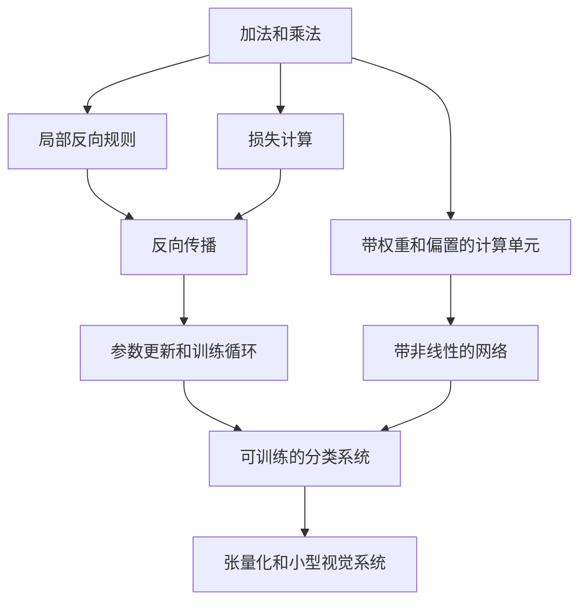

# 深度学习游戏调研与初步设计

调研日期：2026 年 10 月 2 日。目标玩家已经确认：有高中数学基础，没有深度学习经验。

本方案研究如何借鉴《Turing Complete》的构建过程，让玩家通过解决具体问题理解深度学习，并把每一关做出的部件用于后续工程。调研依据包括游戏官方介绍、开发者资料、教学讨论，以及神经网络交互工具和原理实现。游戏机制的描述附有来源；关卡、界面、开发范围和试玩指标均为本项目的设计建议。

**推荐的主线是：从可调的计算部件出发，亲手搭出一套会学习的机器，再用它训练一个小型识别系统。** 首个可玩的版本应让玩家完成一次完整训练，并理解非线性为什么有用。后续版本再将同一套构建机制扩展到张量、泛化和卷积网络。

后续讨论进一步提出了两个方向：在玩家 CPU 或 GPU 上真实训练模型，以及把卷积、池化等功能封装为可拼接模块。推荐将 MNIST 手写数字分类作为完整版本的终章候选，保留 XOR 作为早期原型的阶段目标。详细设计见 [本地训练与模型模块设计](local-training-and-modules.md)。

最新的具体策划见 [关卡树与逐关玩法](level-design.md) 和 [可点击关卡图](level-map.html)。完整方案为 47 个必修关卡与 8 个可选支线；原型先做到 17 关训练器闭环，再扩展到 22 关非线性分类。关卡依赖与逐关操作以这份具体策划为准。

## Turing Complete 的设计启发

《Turing Complete》的官方学习路径是逻辑门、带有记忆的部件、计算机架构，以及在自己硬件上使用汇编解决问题。它从 NAND 开始，逐步连接到算术、存储和完整 CPU。官方商店页同时强调模拟器允许多种解法和自由构建。[游戏官网](https://turingcomplete.game/)，[官方商店介绍](https://store.steampowered.com/app/1444480/Turing_Complete/)

这条路径对于本项目最有价值的启发，是学习成果可以不断变成新的构建工具。结合官方描述，可以提炼出以下设计原则；这些原则是本次调研的分析：

- **前一关的成果进入后一关。** 玩家完成加法器等部件后，能够参与更大系统的构建，因此能够看见局部知识的用途。
- **问题先提出需求。** 当已有工具无法完成任务时，新概念有了明确的使用理由。
- **运行过程可观察。** 玩家能够检查自己的构建与期望行为之间的差异，并据此修改方案。
- **系统允许组合。** 少量基础规则提供足够的组合空间，解法具有个人风格。
- **终点有明确功能。** 完整电脑可以运行程序，早期部件因而与最终目标保持联系。

开发者在商店页说明，每关围绕一个希望玩家自行领悟的想法设计，难度需要通过玩家反馈反复调整。深度学习版也应先确定希望玩家发现什么，再设计促成发现的任务。[开发者说明](https://store.steampowered.com/app/1444480/Turing_Complete/)

一篇 ASEE 教学论文讨论了如何将该游戏的挑战用于数电和计算机架构课程，并说明如何把小规模解码器任务扩展成需要更高层部件的问题。它提供了课程设计参考；文中讨论和学生意向调查不能直接证明本项目的学习效果。[ASEE 论文与摘要](https://peer.asee.org/enhancing-student-understanding-of-digital-logic-and-computer-architecture-through-turing-complete-game-challenges)

## 同类游戏与相邻工具

下表中的游戏机制来自官方资料，最后一列是本项目的借鉴建议。

| 游戏 | 官方资料体现的机制 | 对深度学习游戏的启发 |
| --- | --- | --- |
| [Turing Complete](https://turingcomplete.game/) | 从逻辑门逐步构建计算机，并在自己的硬件上编程 | 把玩家搭出的算子、训练器和网络保留为后续工程部件 |
| [Human Resource Machine](https://tomorrowcorporation.com/humanresourcemachine) 与 [7 Billion Humans](https://tomorrowcorporation.com/7billionhumans) | 用办公室工人执行可视化指令；后者扩展到多个工人同时执行 | 让抽象计算对应可观察动作，逐步增加规则；批处理可在后期借鉴并行执行的表达 |
| [SHENZHEN I/O](https://www.zachtronics.com/shenzhen-io/) | 组合电子元件、编写精简汇编，使用资料手册，自由制作设备 | 用有用途的工程订单组织任务，为进阶玩家提供可展开的部件说明 |
| [Opus Magnum](https://www.zachtronics.com/opus-magnum/) | 开放式机器搭建，比较简单程度、速度与占地，支持分享动画 | 完成基础目标后，再提供参数量、训练计算量和鲁棒性等优化挑战 |
| [while True: learn()](https://luden.io/wtl/) | 通过可视化编程完成机器学习相关订单，复用组件、扩展系统 | 借鉴任务情境和数据流的表达；本项目进一步让玩家参与计算与学习机制的搭建 |
| [Learning Factory](https://luden.io/) | 将工厂自动化、数据分析和机器学习结合，用机器学习改进经营 | 让模型的表现改变游戏世界，使数据质量和训练结果具有实际用途 |
| [The Farmer Was Replaced](https://store.steampowered.com/app/2060160/The_Farmer_Was_Replaced/) | 用类似 Python 的语言自动化农场，通过连续进展解锁技术 | 保留一个持续改进的工程，让新方法解决规模扩大后的具体问题 |

这些作品分别提供了构建、执行、工程任务、优化和持续成长的参考。本项目可以借鉴多种机制，但应把主要操作集中在少量动作上，避免玩家同时学习生产经营、复杂编程和深度学习。

此外有两个相邻工具很值得研究：

- [TensorFlow Playground](https://playground.tensorflow.org/) 可以在浏览器里改变网络结构、学习率、激活函数、数据噪声等条件，并查看训练与测试损失、神经元输出及决策区域。它适合参考实时反馈的呈现。游戏仍需要进一步设计任务、约束、失败线索和部件积累。
- [micrograd](https://github.com/karpathy/micrograd) 展示了如何用标量计算图和反向自动微分构建、训练神经网络。它将神经元拆成小的加法和乘法，直接支持本项目从基础操作逐步组合网络的技术思路。它是原理实现参考，游戏界面、关卡和学习效果仍需独立设计。

## 深度学习版需要处理的差异

数字逻辑部件通常可以按照输入输出规格检查正确性。深度学习中的模型表现还取决于数据、参数初始化、训练过程和评估方法。因此，本项目需要两种任务标准。

**部件任务检查数学行为。** 加法、乘法、梯度传播、参数更新等部件有明确规格，可以展示反例、逐步运行，并检查正负输入、重复使用同一参数等情况。

**模型任务检查学习表现。** 玩家构建的模型需要在给定数据和训练预算下达到目标，并能应对未参与训练的样本。目标应明确描述允许的输入、可调的内容和评估条件。

早期教学使用固定的数据与初始化，保证玩家修改方案时能够比较结果。后期再引入多组初始化、数据噪声和分布变化，让玩家理解稳定性。无法训练时，系统应提供足够的信息判断问题出在构建、梯度、更新还是数据。

针对目标受众，数学概念应从操作经验进入：移动一个参数，观察输出；移动同一个参数，观察误差；比较移动前后，得到变化趋势；再将这种趋势命名为导数或梯度。公式可以在玩家经历现象后展开，形成与真实术语的连接。

## 推荐的游戏设定与主要操作

工作设定建议为一个需要逐步修复的自动分拣站。早期使用重量、亮度等简单传感器，后期接入低分辨率摄像头。玩家的长期目标是让自己搭建的系统学会识别和分拣物品。

这个场景便于把数字、二维特征和图像放进同一个持续工程中。每章结束时，可以把当前模型安装到分拣站，观察正确处理与错误处理的物品。任务扩大后，玩家带着之前的工具回来改进系统。

开场可以提供一个简短的体验任务：运行已经组装好的小模型，观察训练前后的分拣差异，再展开其中需要修复的部件。这样，玩家在学习底层操作前就看见最终用途；后面的关卡逐步让他们获得独立搭建这些部件的能力。

主要操作建议保持为六类：

1. 拖放计算部件并连接端口，决定数据怎样流动。
2. 调节权重、偏置或训练设置，比较结果变化。
3. 单步运行，检查某个样本经过每个部件后的数值。
4. 查看梯度，理解误差对各个参数变化的敏感程度。
5. 封装已经完成的子图，把它放进自己的部件库。
6. 运行训练与验证，查看错误样本，再修改构建。

早期手动调节帮助玩家理解参数的用途。后续自动训练承担重复更新，玩家的注意力转向结构、数据和诊断。训练应运行真实的小规模数值计算，界面动画与实际计算轨迹对应。

## 从基础部件到完整系统的主线

| 阶段 | 主要学习内容 | 玩家亲手形成的成果 | 阶段任务 |
| --- | --- | --- | --- |
| 可调的计算 | 加权求和、偏置、输入输出 | 可调计算单元 | 校准传感器，组合两个测量值 |
| 从错误中学习 | 损失、局部敏感度、链式法则、梯度累加、参数更新 | 能完成一次训练更新的机器 | 自动校准一组参数 |
| 组合出非线性 | 线性能力限制、激活函数、隐藏层 | 可训练的小型多层感知机 | 完成 XOR 或类似的非线性分拣任务 |
| 扩大处理规模 | 向量、矩阵、形状、批处理 | 批量处理样本的网络部件 | 从少量输入扩展到更多传感器和样本 |
| 处理真实数据问题 | 验证、过拟合、数据覆盖、归一化、正则化 | 能检查与改进泛化的训练流程 | 处理新来源物品、带噪测量和偏差样本 |
| 学会看图像 | 卷积、权重共享、特征图、池化与多分类 | 可由玩家拼接并训练的小型卷积识别系统 | 从简单标记过渡到 MNIST 手写数字分类 |

这是一条建议的依赖路径。首版应优先验证前三阶段，后续阶段的具体顺序根据试玩调整。多分类概率与交叉熵可以在视觉章节前引入；早期使用平方误差和连续输出，减少同时出现的数学负担。

**最接近“从逻辑门到 CPU”的阶段性成果，是玩家自己搭出的训练器加上可训练网络。** 最终的视觉系统让这套工具获得更直观的用途。Transformer、语言建模和强化学习适合作为后续独立章节，需要另行设计序列、注意力或环境反馈的学习路径。

部件复用的关系可以表示为：

## 核心机制的关卡例子

下面的十四类任务用于说明主要学习机制。一个概念可以通过引入、组合和迁移在不同关卡中重复使用。具体拆分、分支和前置关系已整理在最新的关卡树中；本表作为机制参考。

| 关卡 | 情境与操作 | 主要发现 | 留给后续的工具 |
| --- | --- | --- | --- |
| 校准放大器 | 调节乘法部件中的增益，让几个测量值接近期望输出 | 权重控制输入影响的强度 | 乘法部件与可调参数 |
| 修正零点 | 所有输出都出现固定偏移，增加一个可调常数 | 偏置改变整体位置 | 带偏置的计算单元 |
| 混合两个信号 | 连接两个输入，为它们分配不同权重 | 多个特征可以共同影响输出 | 加权求和模块 |
| 安装误差计 | 正负误差互相抵消，构建平方误差 | 需要能衡量表现的目标 | 损失模块的正向部分 |
| 试探一个旋钮 | 小幅移动参数，比较移动前后的误差 | 局部变化趋势提供调整线索 | 有限差分探针 |
| 加法怎样传回变化 | 完成加法部件的反向规则，检查几个输入 | 加法对两个输入的局部导数均为 1 | 有反向端口的加法 |
| 乘法怎样传回变化 | 用正数、负数和零检查乘法的反向规则 | 乘法对一个输入的局部导数由另一个输入决定 | 有反向端口的乘法 |
| 穿过多层机器 | 把局部规则串起来，从损失端反向运行 | 沿路径组合局部导数 | 链式传播能力 |
| 一个参数有两条路 | 同一参数参与两个分支，修复漏掉的贡献 | 多条路径的梯度需要相加 | 正确处理共享参数的梯度累加 |
| 自动迈出一步 | 将梯度连接到参数更新，并调节步长 | 参数沿负梯度方向更新，步长影响结果 | 基础梯度下降更新器 |
| 让训练持续运行 | 组织一次次正向、清空梯度、反向和更新 | 学习是有状态的迭代过程 | 可复用训练循环 |
| 直线的能力边界 | 在 XOR 数据上尝试线性结构，包括叠加线性层 | 这种任务需要超出线性模型的表达能力 | 明确的结构需求 |
| 加入一个折点 | 使用正向为分段函数的 ReLU，并检查其反向行为 | 非线性改变模型可表达的函数 | 可训练的激活部件 |
| 组装第一个分类网络 | 组合计算单元、激活和训练器，训练小网络完成 XOR | 基础规则可以组成完整的学习系统 | 玩家自己的可训练网络 |

第十二关应提供几何反馈和逐级提示，帮助玩家发现能力限制，避免让他们长时间尝试无法满足任务的结构。XOR 阶段使用四组基本输入检查功能，之后另设二维分类任务检查迁移；四组输入上的成功本身不构成泛化能力的证明。

早期显示的类别判定可以放在模型输出后的观察环节。参与梯度训练的路径应保持所选算子可微或采用明确的分段导数约定，让玩家做出的梯度规则与训练一致。

## 几个值得优先打磨的关卡

### 乘法部件的反向接线

玩家已经做出了正向乘法器，输入为 a 和 b，输出为 a×b。新的任务是让它同时支持“输出变化对输入变化的敏感度”向后传播。

当输出端收到上游梯度 g 时，向 a 传回 g×b，向 b 传回 g×a。界面先允许玩家用微小改动观察规律，再让玩家完成端口连接。测试必须包含负数；例如 a 为 −2、b 为 3、g 为 1 时，传向两个输入的数值应分别为 3 和 −2。

完成后，玩家把正向计算和反向规则封装成同一个部件。后面的网络直接复用它。这种设计把链式法则变成可操作的组合规则。[计算图与反向传播原理](https://colah.github.io/posts/2015-08-Backprop/)

### 学习率为什么会影响训练

给玩家一个已经能正确计算梯度的简单系统，只开放步长调节。固定输入 x 为 2，目标输出为 6，初始权重 w 为 1；预测为 w×x，损失为预测误差平方的一半。

初始预测为 2，损失为 8，损失对 w 的梯度为 −8。学习率取 0.1 时，一次更新后 w 变为 1.8，预测为 3.6，损失降为 2.88。玩家能看到更新方向和更新幅度怎样影响结果。

在这个特定二次函数上，学习率取 0.5 会在 w 为 1 和 5 之间来回移动，损失保持为 8；取更大的值可能发散。关卡用这个可解释的例子建立直觉，后续再展示不同问题对步长的要求会改变。

### 线性结构遇到 XOR

四个样本放在二维平面的四个角上，相同类别处于对角。玩家可以改变线性单元的权重和偏置，并观察决策边界，但无法用单一直线正确分开全部样本。

接下来允许组合多个线性层，观察整体边界仍然受到线性结构限制。加入非线性后，隐藏单元可以形成不同的区域，输出层再组合这些区域。玩家因此能够看到为什么需要这种新部件。

本关的反馈要把结构限制与训练失败区分清楚。提示可以依次展示错分样本、边界形状，以及几种已尝试结构的共同限制；最后开放 ReLU 的实验任务。

### 训练表现与实际表现出现差异

这是后续泛化章节的建议关卡。给模型一组带有背景颜色关联的物品图片；训练样本中，颜色恰好经常与类别一致。系统在相似样本上表现很好，换到不同背景后开始错误分拣。

玩家通过错误样本检查和补充数据，发现模型可能依赖了不稳定的特征。关卡应让数据构成、模型复杂度和验证表现可比较，并逐个开放改进手段，避免一次同时引入多种原因。

平时的反复比较应使用验证集，最终评估使用未用于调参的测试集。数据预处理中的统计量也应仅从训练集得到。这样，游戏规则与真实的评估习惯保持一致。[数据泄漏与预处理的官方说明](https://scikit-learn.org/stable/common_pitfalls.html)

## 反馈界面与部件积累

界面建议围绕三个区域和一个运行控制区组织：

| 区域 | 玩家需要的信息 | 设计重点 |
| --- | --- | --- |
| 任务与样本 | 期望行为、当前限制、输入样本和标签 | 开局就能明白需要完成什么，优先显示具体案例 |
| 构建工作台 | 数据流、端口、参数和可展开模块 | 节点直接显示当前数值，选中后展开局部规则 |
| 结果观察 | 当前预测、错误样本、决策区域或特征图 | 让构建修改与行为变化保持可见联系 |
| 运行控制 | 单步、一次训练更新、连续训练、暂停和恢复 | 允许在动画解释与快速运行之间切换 |

正向视图显示当前样本如何变成预测；反向视图显示损失对中间量和参数的敏感度。两种视图共用同一张构建图，通过箭头方向、数值与文字标签区分含义。梯度的颜色应始终对应明确的正负或幅值说明。

训练曲线用于发现趋势，错误样本用于解释问题。早期每关只展示与当前问题相关的指标；梯度分布、验证曲线和混淆矩阵等工具在对应章节逐步出现。

玩家完成的模块可以命名、保存并再次展开。封装后保留输入输出规格、参数以及反向行为。后续的向量部件可以提供高效运行方式，同时允许玩家查看它与已学标量操作的对应关系。

阶段成果应安装到分拣站中运行。玩家看到自己做出的模型发挥作用，也能带着新需求回来改进原来的构建。

## 关卡规则与学习验证

每关建议记录以下内容，作为后续关卡配置的基础：

- 玩家需要发现的主要概念，以及已经掌握的前置工具。
- 具体任务、允许的部件、可编辑范围和资源约束。
- 能暴露典型误解的输入与反馈。
- 逐级提示，从观察线索逐步推进到局部解释。
- 通关标准、可选优化目标和通关后保存的模块。
- 一项改变情境的迁移任务，用于检查理解是否可以继续使用。

部件关卡按规格检查，允许等价构建；模型关卡按约定数据与预算检查表现。基础通关要求应容易解释，额外挑战再比较参数量、训练计算量、推理计算量或对指定扰动的表现。

训练预算建议使用更新次数或实际计算操作数量，使评分较少受玩家电脑速度影响。重复验证过的前向与反向规则在封装后可以高效执行，避免把重复接线变成主要负担。

试玩应重点观察三个问题：玩家能否根据反馈提出一次有理由的修改；提示撤去后能否解决变化后的同类问题；完成训练后能否说清数据、损失、梯度和参数更新之间的联系。通关率与游玩时长可以辅助判断难度，但需要结合这些行为评估学习。

## 实现架构建议

首版建议使用可在本地浏览器运行的二维工作台，搭配自有的小型标量计算引擎。TensorFlow Playground 说明这类小网络交互可以在浏览器呈现；micrograd 提供了基础计算图与自动微分的实现参考。后期大批量计算可以接入 TensorFlow.js 等张量执行后端，在玩家 CPU 或支持的 GPU 上完成正向、反向和参数更新。TensorFlow.js 官方已有浏览器内训练手写数字 CNN 的示例。[本地训练与执行后端的详细设计](local-training-and-modules.md)，[官方训练教程](https://www.tensorflow.org/js/tutorials/training/handwritten_digit_cnn)

建议让以下职责独立维护：

| 模块 | 职责 |
| --- | --- |
| 计算图表示 | 记录输入、常量、参数、操作节点、端口、连接和模块引用 |
| 数值执行 | 按依赖顺序执行正向计算，缓存中间值，反向计算并累加梯度 |
| 训练状态 | 管理参数、数据顺序、梯度清空、优化器和训练步数 |
| 教学反馈 | 读取真实执行轨迹，显示单步结果、局部梯度、边界和错误样本 |
| 任务与判定 | 定义部件白名单、数据、约束、提示和通关条件 |
| 部件与存档 | 保存玩家模块、任务进度、实验配置和必要的版本信息 |

首版基础节点可以限制为输入、常量、可训练参数、加法、乘法与 ReLU。加权求和、偏置和平方误差由这些基础节点组合得到。可训练参数需要跨训练步保留；临时激活值和梯度则按执行周期管理。

正向计算图保持无环，参数更新发生在一次正向和反向计算完成之后。反向运行从标量损失端的梯度 1 开始，按反向依赖顺序传播。反向传播必须累加来自多条使用路径的梯度；重复训练时清空上一次的梯度，并使用当前正向缓存。这些行为既是引擎正确性的要求，也对应玩家需要理解的机制。

后续加入矩阵、批处理和卷积时，应保留同样的数学语义。共享卷积参数接收来自多个位置的梯度贡献。卷积有助于复用位置上的局部特征；平移后特征图怎样变化、分类输出能否保持稳定，需要结合汇聚、数据和训练进行观察，不能直接把卷积等同于对所有变化都不敏感。

实现验证应覆盖算子输出、局部与组合梯度、共享参数梯度、一次参数更新及小任务训练行为。数值梯度检查应避开 ReLU 的不可导点，并使用明确的误差容限；训练关卡需预先检查多组配置，降低初始化造成的意外卡关。

## 原型范围与开发顺序

当前原型建议分两步推进：先实现关卡树从 P00 到 B09 的 17 个必修关卡，形成真实训练器闭环；再扩展到 C05，总计 22 个必修关卡，完成非线性分类。范围包含标量构建、反向传播、可保存模块与训练控制。优先建立三个完整体验节点：

1. 玩家连接输入、权重和偏置，改变它们后立刻看到输出变化。
2. 玩家完成反向规则与更新机制，让机器通过重复更新降低损失。
3. 玩家用已经做出的工具构建一个小网络，完成线性模型无法完成的分类。

先实现这些体验所需的最小引擎和反馈，再补齐关卡与提示。完成核心试玩后，扩展顺序建议为模块封装、二维分类诊断、张量和批处理、数据泛化、小型图像识别。

视觉章节的前置任务可以使用程序生成的 8×8 或 16×16 标记，例如箭头或简单形状。小规模图像便于展示每个像素、卷积窗口和特征图，也便于控制噪声、位置和背景条件。完整版本的终章候选改为 MNIST 手写数字分类：玩家拼接已经学会并封装的部件，在本机训练，再识别未用于训练的数字。终章后增加手写画板，让玩家体验自己模型对个人笔迹的识别。训练耗时与通关阈值需要在原型中实测。

第一轮试玩可以邀请少量符合目标受众的玩家，观察他们在哪个环节需要提示，是否把反向规则理解为可组合的规律，以及是否愿意主动优化自己的机器。这些观察用于调整关卡密度；后续若要评价学习效果，再设计包含前测、后测和迁移任务的研究。

## 下一步需要验证的设计假设

本阶段形成了可进入原型设计的方向，以下问题仍需通过界面草图、关卡脚本和试玩验证：

- 接线与单步执行是否足以让高中数学背景的玩家理解局部导数，还是需要更强的位移和变化量表现。
- 玩家保存并复用模块，是否能产生持续构建的成就感，以及模块展开的粒度应该多细。
- XOR 的能力限制是否能够被直观发现，十四关的密度是否合适。
- 分拣站作为长期项目是否有吸引力，阶段成果安装运行是否值得玩家期待。
- 从固定数据过渡到验证和泛化时，玩家是否能根据错误样本诊断原因。

建议下一轮产出首版关卡脚本和一份能实际运行的最小原型，优先验证“操作、反馈、发现、封装、复用”这条体验链。

## 资料索引

以下资料用于查证游戏机制和原理。网页访问日期为 2026 年 10 月 2 日；作品和工具可能继续更新。

| 资料 | 本次使用范围 |
| --- | --- |
| [Turing Complete 官网](https://turingcomplete.game/) | 从逻辑门、部件到架构与汇编的学习路径 |
| [Turing Complete 官方商店页](https://store.steampowered.com/app/1444480/Turing_Complete/) | 构建自由度、模拟器、开发者对关卡设计的说明 |
| [Human Resource Machine 官网](https://tomorrowcorporation.com/humanresourcemachine) | 可视化指令、逐步解锁与可选优化挑战 |
| [7 Billion Humans 官网](https://tomorrowcorporation.com/7billionhumans) | 多执行者的编程模型与提示设计 |
| [SHENZHEN I/O 官网](https://www.zachtronics.com/shenzhen-io/) | 元件组合、资料手册、汇编与沙盒 |
| [Opus Magnum 官网](https://www.zachtronics.com/opus-magnum/) | 开放式构建、优化与方案分享 |
| [while True: learn() 官网](https://luden.io/wtl/) | 可视化机器学习任务、组件复用与系统扩展 |
| [Luden.io 官方作品介绍](https://luden.io/) | Learning Factory 的自动化与机器学习定位 |
| [The Farmer Was Replaced 官方商店页](https://store.steampowered.com/app/2060160/The_Farmer_Was_Replaced/) | 自动化、逐步引入编程概念与连续进展 |
| [TensorFlow Playground](https://playground.tensorflow.org/) | 网络结构、训练条件和可视化反馈 |
| [micrograd 官方仓库](https://github.com/karpathy/micrograd) | 标量计算图、反向自动微分与网络训练 |
| [Calculus on Computational Graphs Backpropagation](https://colah.github.io/posts/2015-08-Backprop/) | 局部导数、链式法则、路径贡献与反向传播 |
| [scikit-learn 常见问题与推荐实践](https://scikit-learn.org/stable/common_pitfalls.html) | 评估数据隔离、预处理一致性和数据泄漏 |
| [ASEE 的 Turing Complete 教学论文](https://peer.asee.org/enhancing-student-understanding-of-digital-logic-and-computer-architecture-through-turing-complete-game-challenges) | 课程任务扩展与教学整合讨论 |
