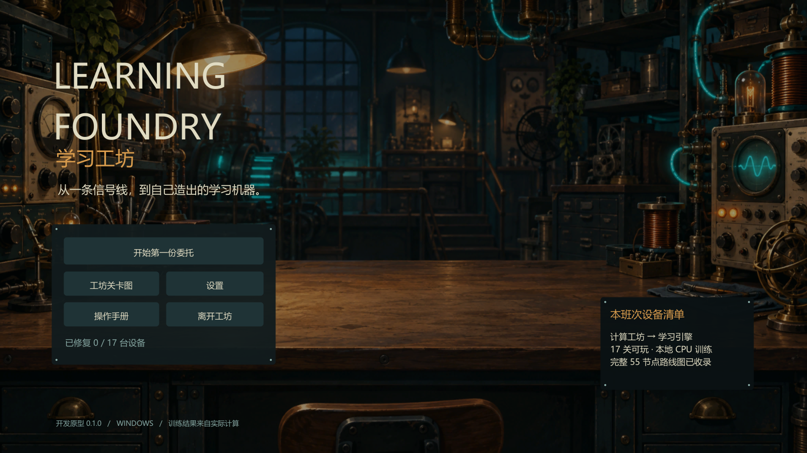
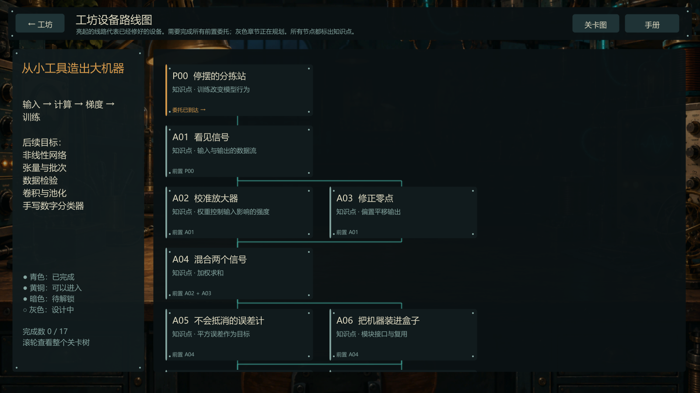
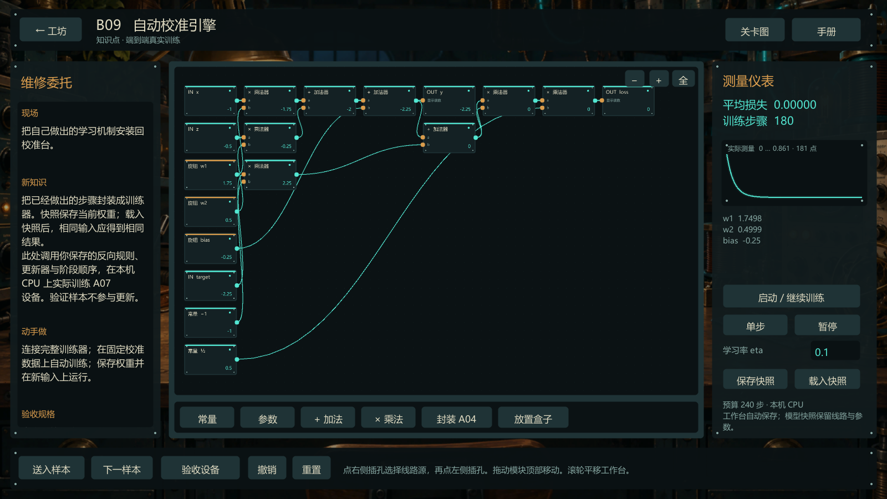
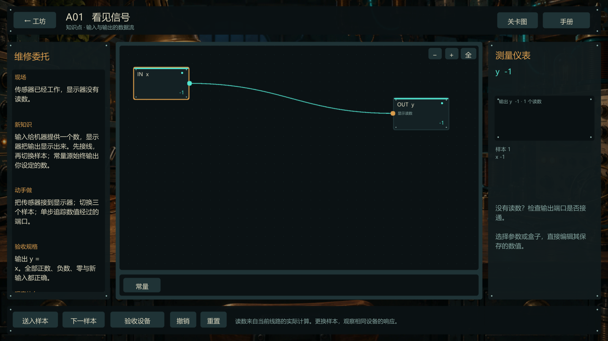

# Unity 原型验证记录

2026-10-02 · Learning Foundry 0.1.0。

## 已验证的交付

- 编辑器：本机 `F:\Unity\Installs\2022.3.62f1\Editor\Unity.exe`，实际引擎版本 2022.3.62f1。
- 工程：`F:\Documents\GitHub\GameDev_DeepLearning_Game\UnityGame`。
- 构建：Windows x64，Mono，窗口模式，Unity 原生 uGUI。已有 Unity CLI 和 Windows 构建支持完成构建，没有新增安装。
- 可运行入口：`UnityGame/Builds/Windows/LearningFoundry.exe`，同目录依赖须保留。
- 55 个关卡节点正确加载，17 个实际玩法节点的前置均属于已实现内容；其余节点显示规划状态。

## 核心引擎：58 项检查通过

报告见 [`core-verification.json`](../verification/core-verification.json)。检查覆盖：

- 加法/乘法玩家反向规则，正数、负数、零与非单位上游梯度。
- 参数更新方向与零梯度；四读数平均器对正值和有符号梯度的求值。
- A01–A03 正确方案通过，固定输出的投机线路被拒绝。
- A04 三个实际参数；A05 正负/零残差；A06 独立实例；A07 模型/损失组合。
- A07/B09 在参数扰动后重新检查损失，拒绝以固定零损失替代真实误差路径。
- 链式法则、共享分支与同一操作数重复使用的回流，和有限差分结果对照。
- 错误回流方向、覆盖梯度、缺少本轮清空、反向前更新参数等失败情况。
- 训练循环中两种满足依赖的顺序产生相同结果。
- 稳定/不稳定学习率在同一目标和同一预算下的实际轨迹。
- 循环连线与未连接输出的可解释异常；重复反向不会残留旧梯度。
- 参数、模块实例与训练结果经过 JSON 保存/读取后保持数值。
- P00 参考机器在相同样本上实际改善。

CPU 训练固定测试为 4 个训练样本、3 个独立新输入；使用玩家规则、更新器与平均器，180 步后平均训练损失为 `7.7477170214724425e-9`，新输入通过规定容差。该成绩针对很小的仿射校准任务，不是 MNIST 准确率或 GPU 性能测量。

## Windows 原生运行与画面

报告见 [`player-smoke.json`](../verification/screenshots/player-smoke.json)。原生构建启动、加载关卡与资源、执行 180 步真实训练、生成 Unity 摄像机渲染图并正常退出。测试使用隔离的内存存档，不写玩家的正常进度。

原生测试还实际执行 P00 的观察→训练→再次观察→验收，通过下一关按钮进入 A01，调用两个实际插孔按钮回调接通线路，通过 A01 验收并解锁 A02。报告中 `tutorialFlow` 与 `pinConnection` 均为 true。该测试验证游戏内部 UI 回调与进度逻辑，没有代替真人鼠标操作体验。

实际渲染设备识别为 NVIDIA GeForce RTX 4070 Laptop GPU，Direct3D 11。此信息只说明 Unity 图形渲染工作正常；数学训练仍在 CPU 执行。

截图采用 Unity 摄像机到 RenderTexture 的真实渲染，以支持隐藏/最小化的测试窗口。最初屏幕缓冲截图为黑色，改成此方式后重新生成并视觉检查了实际界面；最终交付只使用修复后的画面。

## 尚未验证 / 尚未实现

数学检查与自动原生运行没有替代人从零完成 17 关的完整试玩。还需人工检查所有鼠标/键盘路径、接线误触、长文本滚动、快照恢复、不同分辨率、大字号和存档损坏恢复体验。

未实现完整 C–G/S 章节、张量执行、GPU 训练、MNIST 数据与分类终章、完整音频/动画、多输出子图封装、Steam SDK、跨平台或 Steam Deck 支持。当前构建是开发切片，不是可直接宣称已经达到 Steam 成品质量的版本。

下一阶段验收以 [制作里程碑](production-design.md) 为准。任何改动涉及数值规则、存档结构或训练流程时，重新运行对应检查；仅界面样式变化以编译、原生运行和视觉检查验证。
